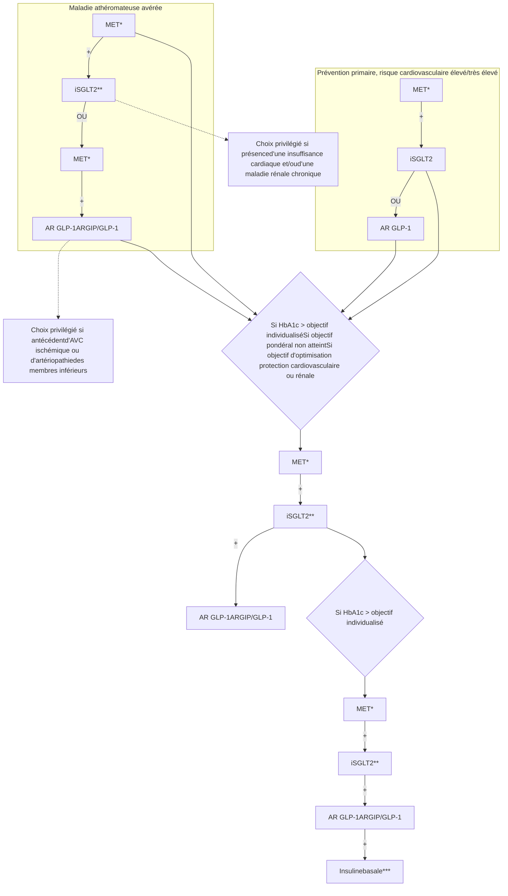
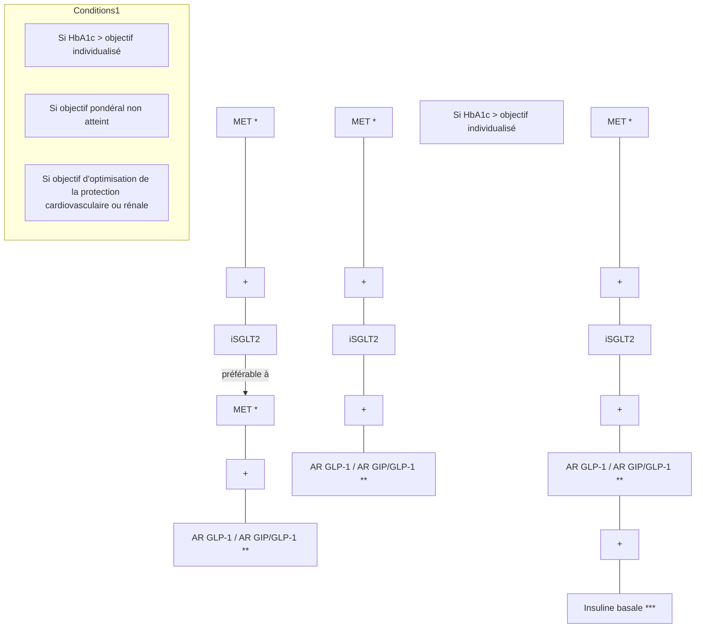
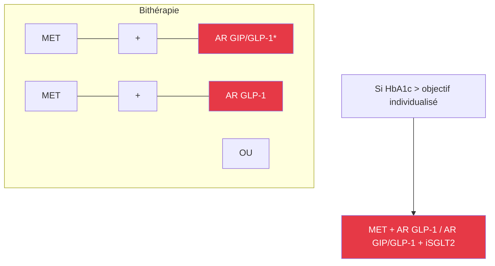
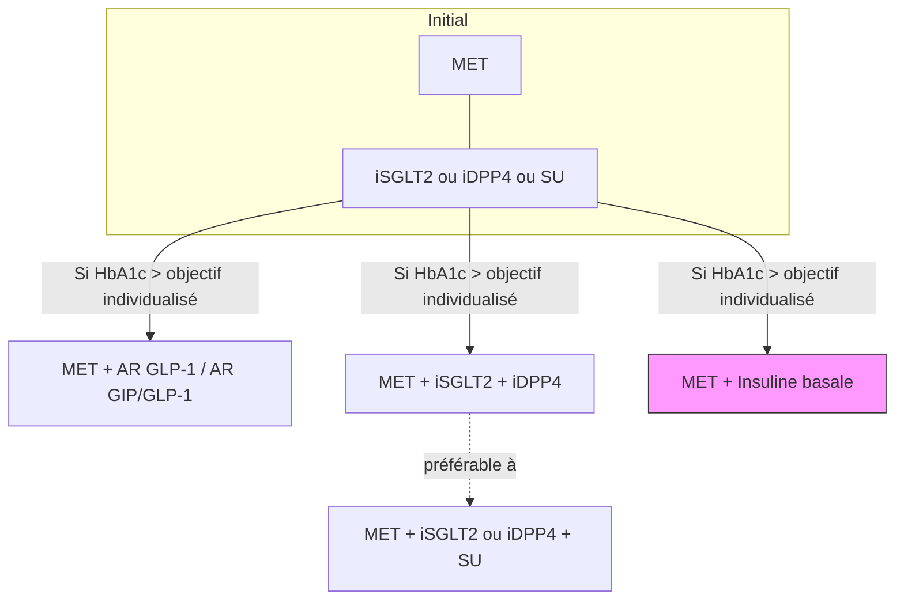
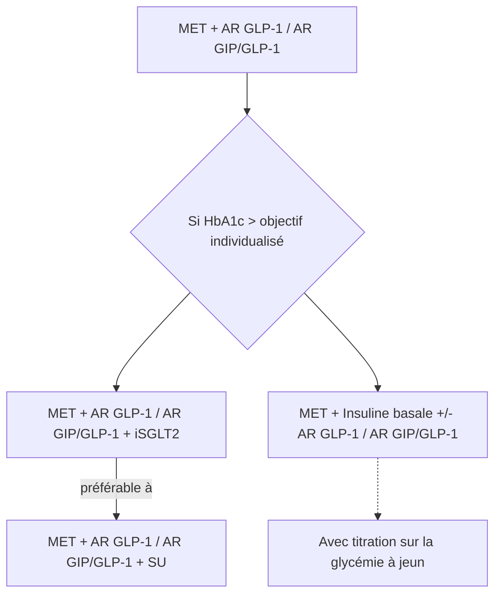
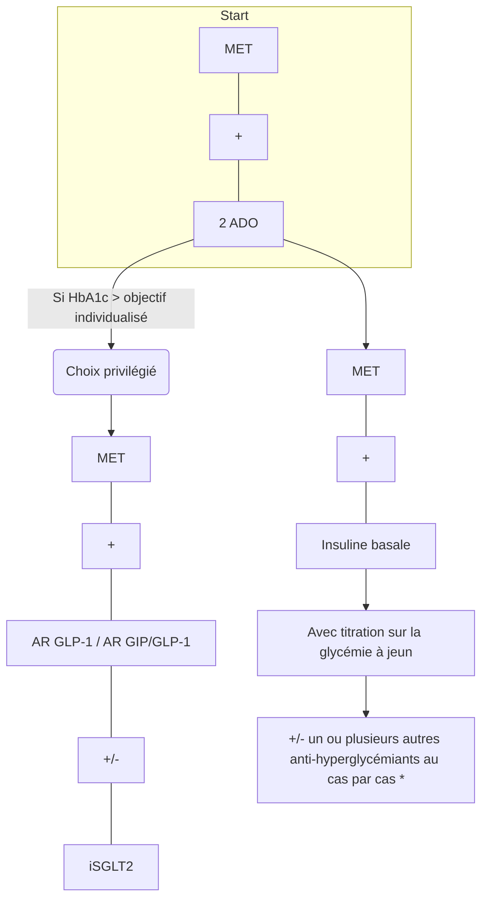
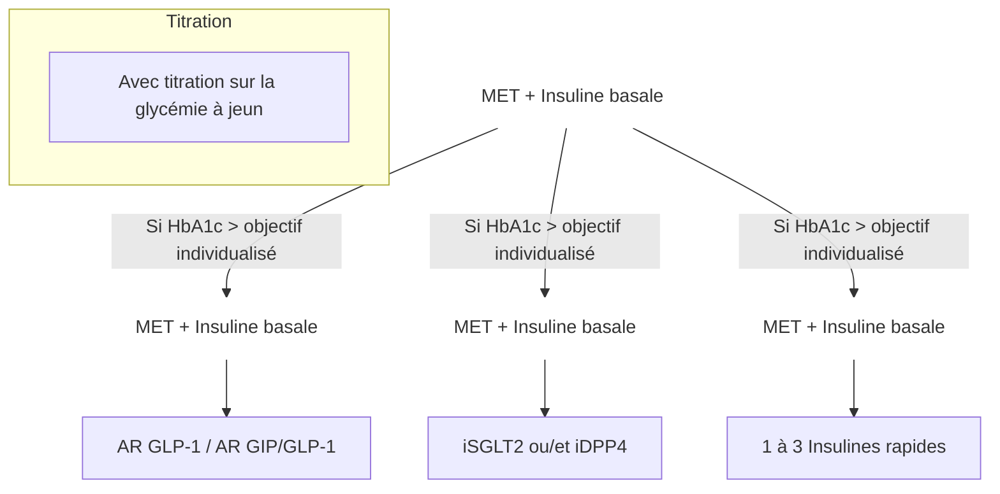

Med Mal Metab 2025; 19: 630–662
en ligne sur / on line on
www.em-consulte.com/revue/mmm
www.sciencedirect.com

# Prise de position de la Société Francophone du Diabète (SFD) sur les stratégies d'utilisation des traitements de l'hyperglycémie dans le diabète de type 2 – 2025

# Recommandations et référentiels

Patrice Darmon, Bernard Bauduceau, Lyse Bordier, Bruno Detournay, Olivier Dupuy, Pierre Gourdy, François Jornayvaz, Emmanuelle Lecornet-Sokol, Alfred Penfornis, Eric Renard, André Scheen, Ariane Sultan, Tiphaine Vidal-Trecan, pour la SFD

Disponible sur internet le :
13 novembre 2025

Société francophone du diabète (SFD), secrétariat permanent, 60, rue Saint-Lazare, 75009 Paris, France

**Correspondance :**
Patrice Darmon, Société francophone du diabète (SFD), secrétariat permanent, 60, rue Saint-Lazare, 75009 Paris, France.
Patrice.Darmon@ap-hm.fr

***Strategies for use of antihyperglycemic treatments in type 2 diabetes: Position Statement of the Francophone Diabetes Society – 2025***

## Composition du groupe de travail de la SFD

Pr Bernard Bauduceau (endocrinologue-diabétologue, Saint-Mandé)
Pr Lyse Bordier (endocrinologue-diabétologue, Saint-Mandé)
Pr Patrice Darmon (endocrinologue-diabétologue, Marseille)
Dr Bruno Detournay (économiste de la santé, Bourg-la-Reine)
Dr Olivier Dupuy (endocrinologue-diabétologue, Paris)
Pr Pierre Gourdy (endocrinologue-diabétologue, Toulouse)
Pr François Jornayvaz (endocrinologue-diabétologue, Genève)
Dr Emmanuelle Lecornet-Sokol (endocrinologue-diabétologue, Paris)
Pr Alfred Penfornis (endocrinologue-diabétologue, Corbeil-Essonnes)
Pr Eric Renard (endocrinologue-diabétologue, Montpellier)

Pr André Scheen (endocrinologue-diabétologue, Liège)
Pr Ariane Sultan (endocrinologue-diabétologue, Montpellier)
Dr Tiphaine Vidal-Trecan (endocrinologue-diabétologue, Paris)

### Coordination de la rédaction
Pr Patrice Darmon (endocrinologue-diabétologue, Marseille)

### Composition du groupe de relecture
Pr Fabrizio Andreelli, endocrinologue-diabétologue (Paris)
Mme Marie Bouly, infirmière en pratique avancée (Corbeil-Essonnes)
Pr Jean Doucet, interniste et diabétologue, Professeur de thérapeutique (Rouen)

Médecine des maladies Métaboliques
tome 19 > n°8 > décembre 2025
10.1016/j.mmm.2025.10.002
© 2025 Elsevier Masson SAS. Tous droits réservés, y compris ceux relatifs à la fouille de textes et de données, à l'entraînement de l'intelligence artificielle et aux technologies similaires.
630

Med Mal Metab 2025; 19: 630–662

Pr Bruno Fève, endocrinologue-diabétologue (Paris)
Pr Serge Halimi, endocrinologue-diabétologue, Professeur émérite de nutrition (Grenoble)
Dr Jean-Yves Legoff, médecin généraliste (Saint Brieuc)
Pr Laurent Meyer, endocrinologue-diabétologue (Strasbourg)
M. Bastien Roux, directeur général de la Fédération française des diabétiques (FFD)
Dr Jean-François Thébaut, vice-président de la Fédération française des diabétiques (FFD)
Pr Bruno Vergès, endocrinologue-diabétologue (Dijon)

> Les membres du groupe de relecture ont émis un certain nombre de remarques et de suggestions sur ce texte. Certaines d'entre elles ont été prises en compte par le groupe de travail de la SFD, d'autres non. Cependant, tous les relecteurs susnommés ont accepté d'endosser la prise de position de la SFD dans la version finale présentée ici.

# Prise de position de la Société Francophone du Diabète (SFD) sur les stratégies d'utilisation des traitements de l'hyperglycémie dans le diabète de type 2 – 2025

Patrice Darmon, Bernard Bauduceau, Lyse Bordier, Bruno Detournay, Olivier Dupuy, Pierre Gourdy, François Jornayvaz, Emmanuelle Lecornet-Sokol, Alfred Penfornis, Eric Renard, André Scheen, Ariane Sultan, Tiphaine Vidal-Trecan pour la SFD

## Partie 1. Bénéfice du contrôle glycémique sur la micro et la macroangiopathie

### Avis nᵒ 1 - Bénéfice du contrôle glycémique sur la micro et la macroangiopathie

• La prévention des complications vasculaires du diabète de type 2 (DT2) exige une prise en charge de l'ensemble des facteurs de risque, incluant obligatoirement un contrôle optimisé de l'hyperglycémie.
• Le bénéfice d'un contrôle glycémique optimal sur les complications micro-vasculaires, notamment rétiniennes et rénales, est largement démontré. Ce bénéfice existe également pour les complications macro-vasculaires (notamment les infarctus du myocarde), mais ne devient significatif qu'après un temps plus prolongé de suivi.
• Un critère de substitution est un critère intermédiaire capable de prédire la survenue d'événements cliniques. Au regard de la littérature scientifique disponible, l'hémoglobine glyquée (HbA1c) peut être considérée comme un critère de substitution acceptable pour la survenue des complications micro-vasculaires du diabète, mais pas pour celle des complications macro-vasculaires.

• Chez le patient vivant avec un DT2 présentant un risque cardiovasculaire élevé ou très élevé (cf. Avis nᵒ 7) et/ou une maladie athéromateuse avérée, une insuffisance cardiaque ou une maladie rénale chronique, la SFD préconise de prescrire, selon les cas, et en association aux modifications thérapeutiques du mode de vie et à la metformine, soit un inhibiteur de SGLT2 (iSGLT2), soit un agoniste des récepteurs du GLP-1 (AR GLP-1), soit un double agoniste des récepteurs du GIP et du GLP-1 (AR GIP/GLP-1) à visée de protection cardiovasculaire et/ou rénale et ce, quel que soit le taux d'HbA1c, en choisissant une molécule ayant fait la preuve de ce bénéfice (cf. Avis nᵒ 11, 12 et 13). Pour autant, si l'objectif individualisé d'HbA1c n'est pas atteint après la prescription de l'un ou l'autre de ces traitements, il sera indispensable d'améliorer le contrôle glycémique du patient et donc d'intensifier sa prise en charge, principalement pour prévenir la survenue ou l'aggravation de complications micro-vasculaires ainsi que pour réduire le risque de complications infectieuses et métaboliques aiguës (telles que déshydratation, hyperosmolarité. . .) liées au diabète.

• Chez le patient vivant avec un DT2 en situation d'obésité (IMC $\ge$ 30 kg/m²) ou présentant une maladie hépatique stéatosique ou une stéato-hépatite associées à un dysfonctionnement métabolique (MASLD/MASH), la SFD suggère d'envisager de prescrire, en association aux modifications thérapeutiques du mode de vie et à la metformine, un AR GLP-1 ou un AR GIP/GLP-1 et ce, quel que soit le taux d'HbA1c (cf. Avis nᵒ 14 et 15). Pour autant, si l'objectif individualisé d'HbA1c n'est pas atteint après la prescription de l'un ou l'autre de ces traitements, il sera indispensable d'améliorer le contrôle glycémique du patient et donc d'intensifier sa prise en charge pour les raisons citées précédemment.

## Partie 2. Médecine fondée sur les preuves et décision médicale partagée

### Avis nᵒ 2 - Médecine fondée sur les preuves et décision médicale partagée

• La médecine fondée sur les preuves vise à prendre les meilleures décisions médicales personnalisées pour chaque

# Recommandations et référentiels

tome 19 > n°8 > décembre 2025
Médecine des maladies Métaboliques
631

P. Darmon, B. Bauduceau, L. Bordier, B. Detournay, O. Dupuy, P. Gourdy, et al.

patient et repose sur les connaissances scientifiques établies, mais aussi sur l'expertise et l'expérience du clinicien, le profil du patient, ses préférences et ses choix.
* L'approche centrée sur le patient implique une décision médicale partagée, fondée sur l'échange d'informations détaillées à propos de toutes les options possibles et conclue par une prise de décision éclairée, acceptée mutuellement par le patient et le soignant.

# Partie 3. Individualisation des objectifs glycémiques

## Avis n° 3 - Individualisation des objectifs glycémiques (tableaux I et II)

* L'objectif d'HbA1c doit être individualisé selon le profil du patient et décidé avec lui, et peut donc évoluer au fil du temps (*tableau I*).
* Chez les patients vivant avec un DT2 âgés de moins de 75 ans présentant une espérance de vie supérieure à 5 ans, sans comorbidité(s) sévère(s) ni insuffisance rénale chronique (IRC) sévère ou terminale (débit de filtration glomérulaire DFG < 30 mL/min/1,73 m²), une cible d'HbA1c $\leq$ 7 % (53 mmol/mol) est généralement recommandée. Chez ces patients, on pourra même proposer une valeur cible $\leq$ 6,5 % (47,5 mmol/mol) à condition que cette cible puisse être atteinte par la mise en œuvre des modifications thérapeutiques du mode de vie ou leur renforcement puis, si cela n'est pas suffisant, par un ou plusieurs traitements n'augmentant pas le risque d'hypoglycémie. Cette valeur cible de 6,5 % (47,5 mmol/mol) est également préconisée chez les patientes enceintes ou envisageant de l'être (cf. Avis n° 22).
* Une cible d'HbA1c $\leq$ 8 % (64 mmol/mol) sera proposée chez les patients vivant avec un DT2 âgés de moins de 75 ans présentant une espérance de vie limitée (< 5 ans) et/ou une (ou plusieurs) comorbidité(s) sévère(s) et/ou une IRC sévère ou terminale, ainsi que chez les patients ayant une longue durée d'évolution du diabète (> 10 ans) et pour lesquels la cible de 7 % s'avère difficile à atteindre car l'intensification thérapeutique expose au risque d'hypoglycémies sévères ; dans ces situations, si les patients sont traités par sulfamide hypoglycémiant (SU), glinide ou insuline, il est recommandé de ne pas chercher à atteindre une valeur d'HbA1c < 7 % (53 mmol/mol) pour minimiser le risque hypoglycémique. Il faut cependant garder en tête qu'une HbA1c $\geq$ 7 % n'exclut pas la possibilité que le patient puisse faire des hypoglycémies avec ces traitements.

* Les objectifs glycémiques après l'âge de 75 ans sont détaillés dans l'Avis n° 21.
* En complément de l'HbA1c, la mise en place d'une auto-surveillance glycémique (ASG) est très souhaitable en cas de traitement par SU ou glinides et devient indispensable en cas de traitement par insuline ainsi que pour les patientes enceintes ou envisageant de l'être ; l'ASG peut être intéressante, au moins temporairement, chez certains autres patients (cf. Avis n° 23). Elle est également nécessaire lorsque les valeurs d'HbA1c sont difficilement interprétables (anémie, hémoglobinopathies, hémolyse chronique, insuffisance rénale chronique sévère ou terminale, cirrhose...) (cf. Avis n° 23).
* Chez les patients traités par insuline, le recours à un dispositif de mesure en continu du glucose interstitiel est recommandé (cf. Avis n° 23) ; les données de ces dispositifs fournissent des index qui viennent compléter l'HbA1c comme marqueurs du contrôle glycémique tels que le temps passé dans la cible 0,70–1,80 g/L (*Time in Range*, TIR), le temps passé en hypoglycémie (*Time Below Range*, TBR) ou en hyperglycémie (*Time Above Range* [TAR]) pour lesquels des objectifs individualisés ont été proposés (*tableau II*).

# Partie 4. Évaluation de la participation et l'adhésion thérapeutique du patient

## Avis n° 4 - Participation et adhésion thérapeutique du patient

* Dans tous les cas, la mise en œuvre de modifications thérapeutiques du mode de vie (changement des habitudes alimentaires, lutte contre la sédentarité, activité physique adaptée, amélioration des troubles du sommeil, gestion du stress...), la participation, les préférences et l'adhésion du patient au traitement devront être évaluées avant tout changement et/ou toute intensification thérapeutique, dont les modalités devront, en outre, être co-décidées avec le patient (cf. recommandation de bonne pratique de la Haute Autorité de Santé « Stratégie thérapeutique du patient vivant avec un diabète de type 2 » de 2024*). Les implications sur la vie quotidienne liées à la prise de certains traitements devront aussi être clairement expliquées (traitement hypoglycémiant et permis de conduire par exemple).
* Tout changement et toute intensification thérapeutique doivent être couplés à une éducation thérapeutique personnalisée et à un accompagnement du patient. Celui-ci pourra éventuellement être réalisé par un patient expert bénévole, spécifiquement formé à cet effet (issu par exemple de la Fédération Française des Diabétiques ou des Maisons du Diabète).

# **Recommandations et référentiels**

**Médecine**
des maladies
Métaboliques

tome 19 > n°8 > décembre 2025

632

Med Mal Metab 2025; 19: 630–662

# Recommandations et référentiels

### TABLEAU I
## Objectifs d'HbA1c à individualiser selon le profil du patient

<table>
  <thead>
    <tr>
      <th>Profil du patient</th>
      <th></th>
      <th>HbA1c cible</th>
    </tr>
  </thead>
  <tbody>
    <tr>
      <td rowspan="2"><strong>Personnes âgées de moins de 75 ans</strong></td>
      <td>Patients vivant avec un DT2 : – avec une espérance de vie supérieure à 5 ans – ET sans comorbidité(s) sévère(s) – ET sans IRC sévère ou terminale (stade 4 ou 5)1</td>
      <td>≤ 7 % voire ≤ 6,5 % à condition que cet objectif soit atteignable grâce aux modifications thérapeutiques du mode de vie et/ou à des traitements n'augmentant pas le risque d'hypoglycémie</td>
    </tr>
    <tr>
      <td>Patients vivant avec un DT2 : – avec une espérance de vie limitée (&#x3C; 5 ans) – ET/OU une (ou plusieurs) comorbidité(s) sévère(s) – ET/OU une IRC sévère ou terminale (stade 4 ou 5) 1  – OU ayant une longue durée d'évolution du diabète (> 10 ans) et pour lesquels la cible de 7 % s'avère difficile à atteindre, en particulier lorsque l'intensification thérapeutique expose au risque d'hypoglycémies sévères</td>
      <td>≤ 8 % en restant au-dessus de 7 % en cas de traitement par sulfamide2, glinide ou insuline3</td>
    </tr>
    <tr>
      <td rowspan="3"><strong>Personnes âgées de plus de 75 ans4</strong></td>
      <td>Dites « en bonne santé », bien intégrées socialement et autonomes d'un point de vue décisionnel et fonctionnel et dont l'espérance de vie est jugée satisfaisante</td>
      <td>≤ 7 %5, en évitant au maximum les hypoglycémies en cas de traitement par sulfamide2, glinide ou insuline3</td>
    </tr>
    <tr>
      <td>Dites « fragiles » à l'état de santé intermédiaire et à risque de basculer dans la catégorie des « dépendants et/ou à la santé très altérée »6</td>
      <td>≤ 8 %7, en restant au-dessus de 7 %7, en cas de traitement par sulfamide6, glinide6, ou insuline3</td>
    </tr>
    <tr>
      <td>Dites « dépendantes et/ou à la santé très altérée », en raison d'une polypathologie chronique évoluée génératrice de handicaps et d'un isolement social6,8</td>
      <td>&#x3C; 9 % 7, en restant au-dessus de 7,5 %7, en cas de traitement par insuline3</td>
    </tr>
    <tr>
      <td rowspan="2"><strong>Patientes enceintes ou envisageant de l'être9</strong></td>
      <td>Avant d'envisager la grossesse</td>
      <td>≤ 6,5 %</td>
    </tr>
    <tr>
      <td>Durant la grossesse</td>
      <td>≤ 6,5 % et glycémies capillaires &#x3C; 0,95 g/L à jeun et &#x3C; 1,20 g/L en postprandial à 2 h</td>
    </tr>
  </tbody>
</table>

1Stade 4 : débit de filtration glomérulaire (DFG) entre 15 et 29 mL/min/1,73 m² ; stade 5 : DFG &lt; 15 mL/min/1,73 m².
2Les sulfamides hypoglycémiants sont contre-indiqués en cas d'IRC sévère ou terminale.
3Chez les patients traités par insuline, la surveillance par mesure en continu du glucose permet de dépister les hypoglycémies et contribue à prévenir leur survenue.
4De manière générale, chez les sujets âgés, il est essentiel de minimiser le risque d'hypoglycémie, notamment d'hypoglycémie sévère, pouvant survenir sous sulfamide, glinide ou insuline ; le risque hypoglycémique est plus important lorsque l'HbA1c est inférieure à 7 % mais existe également si l'HbA1c est plus élevée.
5Une attention particulière sera portée au risque d'hypoglycémie en cas de traitement par sulfamide, glinide ou insuline, avec une sensibilisation de l'impact que le choix de ces traitements aura sur la validité du permis de conduire.
6Il est recommandé d'éviter de prescrire un sulfamide ou un glinide chez les sujets âgés « fragiles » et de ne jamais les utiliser chez les sujets âgés « dépendants ».
7Ces valeurs pourront être modulées en fonction du degré de fragilité et de dépendance.
8Chez les personnes âgées « dépendantes et/ou à la santé très altérée », des glycémies préprandiales comprises entre 1,00 et 2,00 g/L constituent un objectif raisonnable.
9Diabète préexistant à la grossesse.

• Des nouvelles modalités de suivi et d'accompagnement, comme la téléconsultation et/ou la télésurveillance, peuvent être mises en place (voire sont recommandées) lorsque cela est possible et pertinent, en accord avec le patient (et/ou son entourage) et en fonction de sa situation clinique, de son éventuelle vulnérabilité ou de tout autre élément susceptible d'influencer ce choix.

*https://www.has-sante.fr/jcms/p_3191108/fr/strategie-therapeutique-du-patient-vivant-avec-un-diabete-de-type-2

## Partie 5. Réévaluation de la réponse thérapeutique

### Avis n° 5 - Réévaluation de la réponse thérapeutique et règles d'arrêt

• L'efficacité thérapeutique et la tolérance de tout médicament de l'hyperglycémie devront être réévaluées, sur la base du dosage de l'HbA1c, trois à six mois après son introduction - voire avant

tome 19 > n°8 > décembre 2025

**Médecine**
des maladies
**Métaboliques**

633

P. Darmon, B. Bauduceau, L. Bordier, B. Detournay, O. Dupuy, P. Gourdy, et al.

<table>
  <caption>
    <b>TABLEAU II</b> 
    <b>Objectifs individualisés de temps dans la cible, en dessous et au-dessus de la cible chez les patients vivant avec un DT2 utilisant un dispositif de mesure en continu du glucose (selon Battelino et al. Diabetes Care 2019;42:1593–1603)</b>
  </caption>
  <thead>
    <tr>
      <th></th>
      <th>Temps passé dans la cible (TIR)1</th>
      <th colspan="2">Temps passé en dessous de la cible (TBR)</th>
      <th colspan="2">Temps passé au-dessus de la cible (TAR)</th>
    </tr>
    <tr>
      <th></th>
      <th>0,70–1,80 g/L</th>
      <th>&#x3C; 0,70 g/L</th>
      <th>&#x3C; 0,54 g/L</th>
      <th>> 1,80 g/L</th>
      <th>> 2,50 g/L</th>
    </tr>
  </thead>
  <tbody>
    <tr>
      <td>Cas général (hors grossesse1)</td>
      <td>> 70 %</td>
      <td>&#x3C; 4 %</td>
      <td>&#x3C; 1 %</td>
      <td>&#x3C; 25 %</td>
      <td>&#x3C; 5 %</td>
    </tr>
    <tr>
      <td>Personne âgée2, et/ou à haut risque d'hypoglycémie sévère 3</td>
      <td>> 50 %</td>
      <td>&#x3C; 1 %</td>
      <td>0 %</td>
      <td>&#x3C; 50 %</td>
      <td>&#x3C; 10 %</td>
    </tr>
  </tbody>
</table>
1Pour les femmes enceintes vivant avec un DT2, l'intervalle cible pendant la grossesse n'est pas de 0,70 à 1,80 g/L mais de 0,63 à 1,40 g/L ; cependant, les objectifs optimaux de temps passé dans cette cible pendant la grossesse ne sont pas clairement déterminés dans cette population.
2Pour les personnes âgées, Battelino et al. ne proposent pas de distinction entre sujets « en bonne santé », « fragiles » et « dépendants » pour les objectifs de temps dans la cible ; ceux-ci peuvent sans doute être revus à la hausse (70 %) pour les personnes âgées « en bonne santé » (avis d'experts SFD).
3Les personnes à haut risque d'hypoglycémie sévère sont celles qui ont un taux plus élevé de comorbidités (déficit cognitif, maladie rénale, maladies cardiovasculaires, dénutrition...) et celles qui ont besoin d'une assistance.

# Recommandations et référentiels

en cas de signes cliniques liés à l'hyperglycémie, d'épisodes d'hypoglycémie, de survenue d'une complication ou d'une intolérance au traitement.

• Au moment de réévaluer la réponse thérapeutique, il convient de porter une attention particulière à l'adhésion du patient au traitement et de lutter contre toute inertie médicale, que ce soit pour arrêter un médicament insuffisamment efficace et potentiellement générateur d'effets secondaires, ou, à l'inverse, pour intensifier la stratégie de traitement si besoin.

• Chez les patients indemnes de maladie athéromateuse avérée, d'insuffisance cardiaque ou de maladie rénale chronique comme chez ceux présentant un risque cardiovasculaire modéré, les inhibiteurs de la DPP4 (iDPP4), les inhibiteurs de SGLT2 (iSGLT2), les agonistes des récepteurs du GLP-1 (AR GLP-1) et les doubles agonistes des récepteurs du GIP et du GLP-1 (AR GIP/GLP-1) seront arrêtés si la baisse d'HbA1c est de moins de 0,5 % (et que l'HbA1c reste supérieure à l'objectif) trois à six mois après l'initiation du traitement, à condition que la titration - possible pour certains iSGLT2, pour certains AR GLP-1 et pour les AR GIP/GLP-1 - ait été adéquate, que l'adhésion au traitement soit jugée satisfaisante et en l'absence de facteur intercurrent de déséquilibre glycémique bien identifié.

• En revanche, chez les patients présentant un risque cardiovasculaire élevé/très élevé et/ou une maladie athéromateuse avérée, une insuffisance cardiaque ou une maladie rénale chronique, les iSGLT2, les AR GLP-1 et les AR GIP/GLP-1 ayant démontré un bénéfice sur ces événements cardiovasculaires et/ou rénaux seront poursuivis quelle que soit l'évolution de l'HbA1c - et pour les AR GLP-1 et AR GIP-GLP-1, y compris si des effets indésirables digestifs ont empêché d'atteindre la dose recommandée pour la protection d'organes (cf. Avis nᵒ 11, 12 et 13). Chez les patients en situation d'obésité (IMC ≥ 30 kg/m²) ou présentant une MASLD/MASH, la poursuite des AR GLP-1 et AR GIP/GLP-1 sera également envisagée quelle que soit l'évolution de l'HbA1c en cas de réponse satisfaisante sur le plan pondéral (> 5 % de perte de poids corporel) (Avis nᵒ 14 et 15).

• Les SU et les glinides seront arrêtés si la baisse d'HbA1c est de moins de 0,5 % (et que l'HbA1c reste supérieure à l'objectif) trois à six mois après l'initiation du traitement, à condition que la titration ait été adéquate, que l'adhésion au traitement soit jugée satisfaisante et en l'absence de facteur identifié de déséquilibre glycémique OU en cas d'hypoglycémies répétées ou sévère(s).

• La réévaluation de la réponse thérapeutique et les règles d'arrêt permettent d'éviter un empilement thérapeutique systématique au fil des années ou même d'envisager parfois une déprescription chez le patient vivant avec un DT2, en particulier chez les sujets fragiles (cf. Avis nᵒ 5 bis et 21).

### Avis nᵒ 5 bis - Déprescription

• La polymédication se définit dans la majorité des études par l'utilisation de cinq médicaments ou plus pendant au moins 6 mois. En 2023, l'Assurance Maladie relevait que plus de 50 % des sujets de 65 ans et plus étaient concernés par cette question, soit 11 millions de personnes en France. Cette polymédication est étroitement associée à la polypathologie, mais elle peut aussi souvent résulter de prescriptions émanant de plusieurs prescripteurs ou être liée à l'automédication. Les difficultés de communication entre spécialistes et médecins généralistes peuvent ainsi aboutir à une multiplication des ordonnances. Il peut en résulter des problèmes d'observance ou de sécurité des prises, mais également des interactions médicamenteuses et d'importants risques iatrogènes entraînant des hospitalisations en

Médecine des maladies Métaboliques
tome 19 > nᵒ 8 > décembre 2025
634

Med Mal Metab 2025; 19: 630–662

urgence et des dépenses inutiles. Inversement, des omissions de médicaments utiles, voire indispensables, sont souvent constatées. Le recours aux ordonnances enregistrées et automatiquement renouvelées, déjà fréquent et qui risque de se développer dans les déserts médicaux, est un facteur favorisant la polymédication. En revanche, l'éducation thérapeutique devrait permettre au malade de connaître le rôle de chaque médicament, d'améliorer l'adhésion au traitement et d'éviter l'automédication. La décroissance thérapeutique concerne l'ensemble des soignants et nécessite leur formation.

* Le pharmacien doit jouer un rôle important dans cette démarche en prenant en compte la parapharmacie, les compléments alimentaires et en consultant régulièrement le dossier pharmaceutique. Chez les patients de plus de 65 ans pour lesquels au moins cinq molécules ou principes actifs remboursés sont prescrits pour une durée consécutive de traitement supérieure ou égale à 6 mois, le pharmacien pourra proposer au patient une analyse des traitements dans le cadre d'un bilan partagé de médication (BPM) se déroulant sous forme d'entretiens, à l'officine, dans un espace de confidentialité.
* Le principal critère pour la poursuite ou non d'un médicament devrait être le rapport entre les bénéfices attendus et les risques estimés sans attendre les effets indésirables. En particulier, la diminution raisonnée du nombre des médicaments est indispensable lorsque les résultats dépassent les objectifs notamment chez les personnes fragiles ou en cas de troubles cognitifs.
* Concernant les agents thérapeutiques de l'hyperglycémie, la déprescription doit systématiquement être proposée devant la survenue d'effets secondaires invalidants comme par exemple, des hypoglycémies avec les SU, les glinides ou l'insuline, des infections génitales récidivantes ou des malaises hypovolémiques avec les iSGLT2 ou des troubles digestifs sévères avec la metformine, les AR-GLP-1 ou les AR GIP/GLP-1. Elle peut aussi être envisagée lorsque les cibles thérapeutiques méritent d'être relevées au regard de la présentation clinique de la personne (cf. *Avis nᵒ 3*).
* La réduction ou l'arrêt d'un traitement constitue un acte médical qui nécessite une bonne connaissance de la personne malade et de la pathologie qui la concerne. Cette démarche intellectuelle prend du temps, nécessite d'évaluer l'adhésion aux traitements ainsi que la fragilité et les capacités fonctionnelles du patient pour adapter les objectifs thérapeutiques et éviter le renouvellement automatique de l'ordonnance. Elle doit être conduite autant que possible en coordination avec l'ensemble des professionnels de santé autour du patient et en respectant les souhaits de ce dernier comme de ses proches. Dans certaines situations, l'acte de déprescription peut nécessiter une réunion de concertation pluridisciplinaire ou une télé-expertise. Dans tous les cas, une surveillance attentive clinique et biologique sera indispensable après la déprescription.

## Partie 6. Avantages et inconvénients des principaux traitements de l'hyperglycémie

Les propositions du groupe de travail de la SFD sur les stratégies thérapeutiques envisageables en fonction des situations cliniques sont fondées sur une analyse de la littérature scientifique et des principales recommandations nationales et internationales disponibles à ce jour et sur l'expérience des membres du groupe, et relèvent de l'avis d'experts. La prise en compte de la troisième composante de la médecine fondée sur les preuves, à savoir les préférences du patient, consiste à présenter les avantages et inconvénients de chacune de ces alternatives thérapeutiques et à en discuter avec le patient. Pour ce faire, les cliniciens peuvent s'aider d'outils d'aide à la décision tels que celui présenté dans le *tableau III*.

### Avis nᵒ 6 - Avantages et inconvénients des principaux traitements oraux de l'hyperglycémie (tableau III)

* Les avantages et inconvénients des principaux traitements oraux de l'hyperglycémie, résumés dans l'outil d'aide à la décision (*tableau III*), sont les suivants :
    - pour la metformine : longue expérience d'utilisation ; bonne efficacité anti-hyperglycémiante ; absence d'hypoglycémie ; neutralité pondérale (ou perte de poids très modeste) ; sécurité cardiovasculaire démontrée et possible bénéfice ; risque de mauvaise tolérance digestive (environ 15 % de patients intolérants), risque de déficit en vitamine B12, rare risque d'acidose lactique en cas de non-respect des contre-indications ou des précautions d'emploi ; faible coût journalier (disponibilité de génériques) ;
    - pour les SU : longue expérience d'utilisation ; bonne efficacité anti-hyperglycémiante ; risque d'hypoglycémie (en particulier avec le glibenclamide, qu'il est préférable de ne plus utiliser) nécessitant une ASG ; prise de poids ; sécurité cardiovasculaire moins bien démontrée que celles des iDPP4, des iSGLT2, des AR GLP-1 et AR GIP/GLP-1 (un seul essai dédié avec le glimépiride vs iDPP4) ; faible coût journalier (disponibilité de génériques) ;
    - pour les iDPP4 : efficacité anti-hyperglycémiante modérée ; absence d'hypoglycémie ; neutralité pondérale ; innocuité cardiovasculaire démontrée (avec cependant un risque accru d'hospitalisations pour insuffisance cardiaque pour la saxagliptine dans l'étude de sécurité cardiovasculaire dédiée) ; excellent profil

# Recommandations et référentiels

tome 19 > nᵒ 8 > décembre 2025

Médecine des maladies Métaboliques

635

P. Darmon, B. Bauduceau, L. Bordier, B. Detournay, O. Dupuy, P. Gourdy, et al.

<table>
<caption>TABLEAU III Outil d'aide à la décision dans le traitement du DT2</caption>
<thead>
<tr>
<th rowspan="2"></th>
<th rowspan="2">Efficacité sur la baisse de l'HbA1c</th>
<th rowspan="2">Risque d'hypoglycémie</th>
<th rowspan="2">Effet sur le poids</th>
<th rowspan="2">Modalité d'administration</th>
<th colspan="2">Bénéfices CV en cas de maladie CV avérée</th>
<th rowspan="2">Progression de la maladie rénale chronique</th>
<th rowspan="2">Principaux effets secondaires</th>
</tr>
<tr>
<th>IDM, AVC ou décès CV</th>
<th>Insuffisance cardiaque (IC)</th>
</tr>
</thead>
<tbody>
<tr>
<td><strong>Metformine</strong></td>
<td>↑↑</td>
<td>Non</td>
<td>↔ (ou ↓ modeste)</td>
<td>Comprimés 2 à 3 prises/jour</td>
<td>Sécurité démontrée</td>
<td></td>
<td>Absence de données</td>
<td>Effets digestifs fréquents</td>
</tr>
<tr>
<td><strong>Sulfamides et glinides</strong></td>
<td>↑↑</td>
<td>Oui + (glibenclamide ++)</td>
<td>↑</td>
<td>Comprimés 1 à 4 prises/jour</td>
<td>Sécurité démontrée pour glimépiride</td>
<td></td>
<td>Absence de données</td>
<td>Hypoglycémies, prise de poids</td>
</tr>
<tr>
<td><strong>Inhibiteur des alpha-glucosidases</strong></td>
<td>↑</td>
<td>Non</td>
<td>↔</td>
<td>Comprimés 3 à 4 prises/jour</td>
<td>Sécurité démontrée chez des patients intolérants au glucose</td>
<td>(pour IC : uniquement si NYHA I ou II)</td>
<td>Absence de données</td>
<td>Effets digestifs très fréquents</td>
</tr>
<tr>
<td><strong>Inhibiteurs de la DPP4 (gliptines)</strong></td>
<td>↑↑</td>
<td>Non</td>
<td>↔</td>
<td>Comprimés 1 à 2 prises/jour</td>
<td>Sécurité démontrée pour sitagliptine</td>
<td>Risque potentiel pour saxagliptine</td>
<td>Effet neutre</td>
<td>Risque très rare de pancréatite aiguë ou antécédents de (à éviter si chronique)</td>
</tr>
<tr>
<td><strong>Inhibiteurs de SGLT2 (gliflozines)</strong></td>
<td>↑↑</td>
<td>Non</td>
<td>↓↓</td>
<td>Comprimés 1 prise/jour</td>
<td>Bénéfices démontrés</td>
<td>Bénéfices démontrés</td>
<td>Bénéfices démontrés</td>
<td>Mycoses génitales Polyurie Déplétion volémique Risque rare d'acidocétose</td>
</tr>
<tr>
<td><strong>Agonistes des récepteurs du GLP-1</strong></td>
<td>↑↑↑</td>
<td>Non</td>
<td>↓↓ à ↓↓↓</td>
<td>Injections sous-cutanées 1/jour à 1/ semaine</td>
<td>Bénéfices démontrés pour liraglutide, dulaglutide et avec niveau de preuve moins élevé pour sémaglutide</td>
<td>Sécurité démontrée (pour IC : uniquement si NYHA I à III)  Bénéfice fonctionnel démontré dans l'IC à FE préservée chez les patients en situation d'obésité avec sémaglutide 2,4 mg/sem</td>
<td>Effet néphroprotecteur démontré pour le sémaglutide  Bénéfices sur l'albuminurie démontrés pour liraglutide, et dulaglutide</td>
<td>Effets digestifs fréquents (nausées, vomissements, diarrhées...)  Lithiases vésiculaires  Très rares cas de pancréatite aiguë ou antécédents de (à éviter si chronique)</td>
</tr>
</tbody>
</table>
Recommandations et référentiels

Médecine
des maladies
Métaboliques

636

tome 19 > n°8 > décembre 2025

tome 19 < n° 8 < décembre 2025

Med-Mal Metab 2025; 19: 630-662

**TABLEAU III (Suite).**

<table>
  <thead>
    <tr>
      <th></th>
      <th>Efficacité sur la baisse de l'HbA1c</th>
      <th>Risque d'hypoglycémie</th>
      <th>Effet sur le poids</th>
      <th>Modalité d'administration</th>
      <th colspan="2">Bénéfices CV en cas de maladie CV avérée</th>
      <th>Progression de la maladie rénale chronique</th>
      <th>Principaux effets secondaires</th>
    </tr>
    <tr>
      <th></th>
      <th></th>
      <th></th>
      <th></th>
      <th></th>
      <th>IDM, AVC ou décès CV</th>
      <th>Insuffisance cardiaque (IC)</th>
      <th></th>
      <th></th>
    </tr>
  </thead>
  <tbody>
    <tr>
      <td><strong>Double agoniste des récepteurs du GIP/GLP-1 (tirzépatide)</strong></td>
      <td>↓↓↓↓</td>
      <td>Non</td>
      <td>↓↓↓↓</td>
      <td>Injections sous-cutanées 1/semaine</td>
      <td>Bénéfices démontrés</td>
      <td>Sécurité démontrée (pour IC : uniquement si NYHA I à III)  Bénéfices démontrés dans l'IC à FE préservée chez les patients en situation d'obésité</td>
      <td>Possible effet néphroprotecteur</td>
      <td>Effets digestifs fréquents (nausées, vomissements, diarrhées...)  Lithiases vésiculaires  Très rares cas de pancréatite aiguë (à éviter si antécédents de pancréatite aiguë ou chronique)</td>
    </tr>
    <tr>
      <td><strong>Analogues lents de l'insuline</strong></td>
      <td>↓↓↓↓</td>
      <td>Oui ++</td>
      <td>↑↑</td>
      <td>Injections sous-cutanées 1/jour</td>
      <td colspan="2">Sécurité démontrée pour glargine (pour IC : uniquement si NYHA I et II) et pour dégludec (pour IC : uniquement si NYHA I à III)</td>
      <td>Effet neutre</td>
      <td>Hypoglycémies, prise de poids</td>
    </tr>
  </tbody>
</table>

Ce tableau résume les caractéristiques de chacune des familles de médicaments antidiabétiques et constitue une aide à la décision dans le choix du traitement médicamenteux de votre diabète de type 2 quand les modifications thérapeutiques du mode de vie (alimentation et activité physique) et les médicaments antidiabétiques que vous prenez peut-être ne suffisent pas ou plus. – Entourez avec votre médecin les familles qui vous semblent intéressantes et possibles pour vous. – Discutez avec lui de vos préférences pour décider ensemble du traitement le plus adapté pour vous.

CV : cardiovasculaires ; IDM : infarctus du myocarde ; AVC : accident vasculaire cérébral ; IC : insuffisance cardiaque ; FEVG : fraction d'éjection du ventricule gauche ; GIP : *glucose-dependent insulinotropic polypeptide* ; GLP1 : *glucagon-like peptide-1* ; NYHA : *New York Heart Association*.

637

# Médecine des maladies Métaboliques

**Recommandations et référentiels**

P. Darmon, B. Bauduceau, L. Bordier, B. Detournay, O. Dupuy, P. Gourdy, et al.

de tolérance (très rares cas de pancréatites aiguës, amenant à éviter leur utilisation en cas d'antécédent de pancréatite aiguë ou chronique) ; coût journalier modéré (disponibilité de génériques) ;
- pour les iSGLT2 : efficacité anti-hyperglycémiante modérée, au moins équivalente à celle des iDPP4 en l'absence d'insuffisance rénale ; absence d'hypoglycémie ; perte de poids (en moyenne 2 à 4 kg) ; protection cardiovasculaire et/ou rénale démontrées en cas de maladie athéromateuse avérée, d'insuffisance cardiaque ou de maladie rénale chronique ; effets indésirables possibles : infections génitales de nature mycosique, rares cas d'infections urinaires, risque potentiel de déplétion volémique, très rares cas d'acidocétose « euglycémique » (en particulier chez des patients étiquetés à tort comme présentant un DT2 ou dans certaines situations particulières : insulinopénie marquée, période chirurgicale, sepsis, jeûne, déshydratation...) ; coût journalier plus élevé que celui des iDPP4.

## **Avis nᵒ 6 bis - Avantages et inconvénients des principaux traitements injectables de l'hyperglycémie (tableau III)**

• Les avantages et inconvénients des principaux traitements injectables de l'hyperglycémie, résumés dans l'outil d'aide à la décision *(tableau III)*, sont les suivants :
- pour les AR GLP-1 : disponibles uniquement sous forme injectable en France (injection s.c quotidienne ou hebdomadaire) ; efficacité anti-hyperglycémiante supérieure à celle des iDPP4 et des iSGLT2, ; absence d'hypoglycémie ; perte de poids (en moyenne 2 à 5 kg, voire plus chez les bons répondeurs) ; produits les plus efficaces sur l'HbA1c et le poids au sein de la classe : sémaglutide 1 mg/sem (ou 2 mg/sem, dosage non commercialisé en France en octobre 2025) et dulaglutide 4,5 mg/sem ; protection cardiovasculaire et diminution du risque de macroalbuminurie démontrées chez les patients à risque cardiovasculaire élevé/très élevé avec le liraglutide 1,8 mg/j, le dulaglutide 1,5 mg/sem, le sémaglutide 1 mg/sem et le sémaglutide oral 14 mg/j (non commercialisé en France en octobre 2025) ; protection rénale et cardiovasculaire démontrée en cas de maladie rénale chronique avérée avec le sémaglutide 1 mg/sem ; effets indésirables possibles : troubles digestifs - surtout à l'initiation du traitement, lithiases biliaires, accélération de la fréquence cardiaque, risque potentiel de de carences nutritionnelles en cas de perte de poids majeure, risque potentiel de sarcopénie chez les patients âgés, très rares cas de pancréatite aiguë amenant à éviter leur utilisation en cas d'antécédent de pancréatite aiguë ou chronique, risque d'aggravation d'une rétinopathie diabétique préexistante en cas de baisse rapide de l'HbA1c (complication non spécifique de la classe), très rares cas de neuropathie optique ischémique antérieure non artéritique avec le sémaglutide ; coût journalier très élevé ;
- pour le tirzépatide (seul AR GIP/GLP-1 disponible à date) : disponible uniquement sous forme injectable (injection s.c hebdomadaire) ; efficacité anti-hyperglycémiante supérieure à celle des AR GLP-1 ; absence d'hypoglycémie ; perte de poids dose-dépendante supérieure à celle observée avec les AR GLP-1 (en moyenne 6 à 12 kg, voire plus chez les excellents répondeurs) ; protection cardiovasculaire démontrée chez les patients en prévention secondaire avec le tirzépatide 15 mg/sem (non inférieur au dulaglutide 1,5 mg/sem dans l'étude SURPASS CVOT) ; possible effet néphroprotecteur (ralentissement du déclin du DFG et de la progression de l'albuminurie vs dulaglutide dans une analyse exploratoire de l'étude SURPASS CVOT, en particulier chez les participants présentant un risque élevé de maladie rénale chronique) ; effets indésirables possibles : troubles digestifs (surtout à l'initiation du traitement et aux posologies les plus élevées), lithiases biliaires, accélération de la fréquence cardiaque, risque de carences nutritionnelles en cas de perte de poids majeure, risque potentiel de sarcopénie chez les patients âgés, très rares cas de pancréatite aiguë amenant à éviter leur utilisation en cas d'antécédent de pancréatite aiguë ou chronique, risque d'aggravation d'une rétinopathie diabétique préexistante en cas de baisse rapide de l'HbA1c (complication non spécifique de la classe) ; coût journalier très élevé (non remboursé en France en octobre 2025) ;
- pour l'insuline : longue expérience d'utilisation ; disponible uniquement sous forme injectable ; excellente efficacité anti-hyperglycémiante si titration appropriée ; risque important d'hypoglycémie avec nécessité d'une ASG chez tous les patients (cf. Avis nᵒ 23) ; prise de poids ; sécurité cardiovasculaire démontrée pour les insulines glargine et dégludec ; coût élevé (très élevé en cas de recours à un(e) infirmier(ère) à domicile).

# **Partie 7. Évaluation du risque cardiovasculaire chez le patient avec un DT2**

## **Avis nᵒ 7. Évaluation du risque cardiovasculaire chez le patient vivant avec un DT2**

• L'évaluation du risque cardiovasculaire est indispensable pour orienter la prescription des traitements de l'hyperglycémie chez

# Recommandations et référentiels

Médecine des maladies Métaboliques
tome 19 > nᵒ8 > décembre 2025
638

Med Mal Metab 2025; 19: 630–662

# Recommandations et référentiels

les patients vivant avec un DT2. Cette évaluation permet également de fixer, chez ces patients, les objectifs de prise en charge des autres facteurs de risque cardiovasculaire.

• Il n'existe pas à ce jour de consensus sur la meilleure façon de définir le niveau de risque cardiovasculaire d'un patient vivant avec un DT2 ne présentant ni maladie athéromateuse avérée, ni insuffisance cardiaque, ni maladie rénale chronique - la présence de l'une ou plusieurs de ces comorbidités indiquant d'emblée un risque cardiovasculaire très élevé. On pourra se référer, au choix, au consensus SFD/SFC (Société Française de Cardiologie) publié en 2021*, à la prise de position des experts de l'ADA (American Diabetes Association) et de l'EASD (European Association for the Study of Diabetes) de 2022** ou aux recommandations de l'ESC (European Society of Cardiology) publiées en 2023***.

• Le consensus SFD/SFC de 2021 préconise la réalisation d'un score calcique chez les patients considérés comme à risque cardiovasculaire élevé pour pouvoir reclassifier leur risque selon le résultat (modéré, élevé ou très élevé).

• Le référentiel ADA/EASD de 2022 considère qu'un patient vivant avec un DT2 présente un risque cardiovasculaire élevé s'il a 55 ans ou plus et qu'il présente au moins deux facteurs de risque parmi hypertension artérielle, dyslipidémie, tabac, obésité et albuminurie.

• Les recommandations de l'ESC de 2023 se fondent sur le SCORE2-Diabetes, une déclinaison de l'échelle SCORE2 (recommandée par la HAS chez les patients sans diabète). L'échelle SCORE2-Diabetes est destinée aux personnes vivant avec un DT2 âgées de 40 à 69 ans, qui ne sont pas classées dans la catégorie à risque très élevé en raison de la présence d'une maladie athéromateuse avérée ou d'une atteinte sévère des organes cibles (définie par : DFG < 45 mL/min/1,73 m² OU RAC (rapport albuminurie/créatininurie) > 300 mg/g OU DFG entre 45 et 59 mL/min/1,73 m² et RAC entre 30 et 300 mg/g OU atteinte microvasculaire diffuse : rétinopathie, neuropathie et RAC entre 30 et 300 mg/g). L'échelle SCORE2-Diabetes estime le risque sur 10 ans de la survenue d'événements mortels et non mortels (infarctus du myocarde, accident vasculaire cérébral) chez les personnes âgées de 40 à 69 ans et intègre, outre ceux du SCORE2 (région géographique d'origine, âge, sexe, tabagisme actif, pression artérielle systolique, cholestérol total, HDL cholestérol), des paramètres propres au diabète comme l'ancienneté de la maladie, l'HbA1c et le DFG. Le calcul du SCORE2-Diabetes est très facile à obtenir après quelques clics sur des calculateurs en ligne ou sur l'application ESC CVD Risk. En fonction du résultat obtenu, la classification est la suivante : $\ge$ 20 %, risque très élevé ; 10–19,9 %, risque élevé ; 5–9,9 %, risque modéré ; < 5 %, risque faible. Un dérivé de l'échelle SCORE2, dénommée SCORE2-OP (Old Person), existe pour estimer le risque cardiovasculaire des personnes âgées de plus de 70 ans, mais elle n'est pas validée chez les patients vivant avec un DT2.

\* Valensi P et al. Diabetes Metab 2021;47:101185 (https://www.sfd.org)

\*\* https://diabetesjournals.org/care/article/45/11/2753/147671/Management-of-Hyperglycemia-in-Type-2-Diabetes

\*\*\* https://www.escardio.org/Guidelines/Clinical-Practice-Guidelines/CVD-and-Diabetes-Guidelines

## Partie 8. Stratégies thérapeutiques chez les patients âgés de moins de 75 ans

### 8.1. Stratégies thérapeutiques au moment du diagnostic du diabète

### **Avis nᵒ 8 - Au moment du diagnostic de diabète : modifications thérapeutiques du mode de vie $\pm$ traitement médicamenteux**

• Au moment du diagnostic, il est indispensable de proposer au patient, par une approche d'éducation thérapeutique personnalisée, des modifications du mode de vie (changement des habitudes alimentaires, lutte contre la sédentarité, activité physique adaptée ; maintien d'une bonne qualité de sommeil...) (cf. recommandation de bonne pratique de la HAS « Stratégie thérapeutique du patient vivant avec un diabète de type 2 » de 2024*). L'effet de ces mesures doit être évalué au bout de trois à six mois avant d'envisager, si l'HbA1c reste supérieure à l'objectif, un traitement par metformine à doses progressives jusqu'à la dose maximale tolérée**, fractionnée en 2 ou 3 prises au cours ou à la fin du repas - sauf contre-indication ou intolérance digestive avérée.

• Si l'on estime, d'un commun accord avec le patient, que les modifications thérapeutiques du mode de vie ne suffiront pas pour atteindre l'objectif d'HbA1c, un traitement par metformine peut être proposé d'emblée (sauf contre-indication), ce qui permet de minimiser le risque d'inertie thérapeutique.

• Chez les patients présentant un risque cardiovasculaire élevé ou très élevé (cf. Avis nᵒ 7) et/ou une maladie athéromateuse avérée, une insuffisance cardiaque ou une maladie rénale chronique, une bithérapie associant de la metformine et un iSGLT2, un AR GLP-1 ou un AR GIP/GLP-1 sera proposée d'emblée en plus des modifications thérapeutiques du mode de vie à visée de protection cardiovasculaire et/ou rénale et ce, quel que soit le taux d'HbA1c, en choisissant une molécule ayant fait la preuve de son bénéfice (cf. Avis nᵒ 11, 12 et 13).

tome 19 > nᵒ 8 > décembre 2025

Médecine des maladies Métaboliques

639

P. Darmon, B. Bauduceau, L. Bordier, B. Detournay, O. Dupuy, P. Gourdy, et al.

* Chez les patients en situation d'obésité (IMC $\geq$ 30 kg/m²) et/ou présentant une MASLD/MASH, une bithérapie associant de la metformine et un AR GLP-1 ou un AR GIP/GLP-1 pourra être envisagée d'emblée, toujours en association aux modifications thérapeutiques du mode de vie (cf. Avis $n^o$ 14 et 15).
* Les changements des habitudes alimentaires et d'activité physique doivent, à chaque fois que possible, donner lieu à un accord avec le patient sur des objectifs spécifiques, réalistes, mesurables, temporellement déterminés et être couplés à une éducation thérapeutique personnalisée avec idéalement l'intervention d'un diététicien et d'un éducateur en activité physique adaptée, et, si nécessaire, un accompagnement psychologique et/ou un accompagnement entre pairs proposé par un patient expert bénévole formé à cet effet, tel que celui proposé par la Fédération Française des Diabétiques ou les Maisons du Diabète.

*https://www.has-sante.fr/jcms/p_3191108/fr/strategie-therapeutique-du-patient-vivant-avec-un-diabete-de-type-2
** Idéalement 2 à 3 g par jour, en sachant que la dose de 3 g par jour n'apporte que peu de bénéfice supplémentaire par rapport à celle de 2 g/j pour un plus haut risque d'effets indésirables digestifs.

## Avis $n^o$ 8 bis - Au moment du diagnostic de diabète : cas particuliers

* Au moment du diagnostic, en cas de déséquilibre glycémique important (HbA1c $\geq$ 8,5 % ou 69 mmol/mol), on pourra proposer d'emblée une bithérapie incluant la metformine, en plus des modifications thérapeutiques du mode de vie (cf. Avis $n^o$ 10 à 15 pour le choix de la bithérapie). Dans cette situation, il est généralement utile de prescrire une ASG à visée d'éducation thérapeutique, au moins de façon temporaire.

* Au moment du diagnostic, en cas de déséquilibre glycémique majeur (HbA1c $\geq$ 10 % ou 86 mmol/mol), l'avis d'un endocrinologue-diabétologue est souhaitable. On pourra proposer d'emblée une bi- ou une trithérapie incluant la metformine (cf. Avis $n^o$ 10 à 16 pour le choix de la bi- ou trithérapie). En présence d'un syndrome polyuro-polydipsique et/ou d'une perte de poids involontaire, le traitement prescrit doit généralement inclure de l'insuline. En cas de déséquilibre glycémique majeur avec hyperosmolarité ou présence de corps cétoniques (cétonurie ou cétonémie pathologique, pouvant évoquer un possible diabète de type 1), une insulinothérapie, mise en place le plus souvent en hospitalisation, est indispensable et doit être couplée à une auto-surveillance à l'aide d'un dispositif de mesure en continu du glucose.

* En cas de déséquilibre glycémique initial majeur, des objectifs gradués de diminution de la glycémie sont nécessaires dans l'attente de la réalisation d'un fond d'œil dans les plus brefs délais, en raison du risque d'aggravation d'une éventuelle rétinopathie préexistante au diagnostic.
* Dans de nombreux cas, le recours initial à l'insulinothérapie est transitoire et un relais par d'autres anti-hyperglycémiants peut être envisagé secondairement - sauf dans certaines situations particulières et notamment lorsque ce tableau clinique révèle en fait un diabète de type 1.

## 8.2. Stratégies thérapeutiques chez le patient vivant avec un DT2 présentant un risque cardiovasculaire faible ou modéré et un IMC < 30 kg/m²

### Avis $n^o$ 9 - Objectif d'HbA1c non atteint malgré les modifications thérapeutiques du mode de vie

* Lorsque l'objectif d'HbA1c n'est pas atteint malgré trois à six mois de modifications thérapeutiques du mode de vie chez un patient présentant un risque cardiovasculaire faible ou modéré et un IMC < 30 kg/m², on proposera, en première intention, un traitement par metformine, à doses progressives jusqu'à la dose maximale tolérée*, fractionnée en deux ou trois prises au cours ou à la fin du repas
* En cas de contre-indication à la metformine ou d'intolérance digestive avérée (persistance de troubles digestifs en dépit d'une augmentation progressive de la posologie, avec doses fractionnées en deux ou trois prises au cours ou à la fin du repas), d'autres options seront envisagées (détaillées dans l'Avis $n^o$ 22).

* Idéalement 2 à 3 g par jour, en sachant que la dose de 3 g par jour n'apporte que peu de bénéfice supplémentaire par rapport à celle de 2 g/j pour un plus haut risque d'effets indésirables digestifs.

### Avis $n^o$ 10 - Objectif d'HbA1c non atteint sous modifications thérapeutiques du mode de vie et metformine : stratégies thérapeutiques (figure 1)

* Chez un patient âgé de moins de 75 ans présentant un risque cardiovasculaire faible ou modéré et un IMC < 30 kg/m², lorsque l'objectif d'HbA1c n'est pas atteint sous modifications thérapeutiques du mode de vie et metformine en monothérapie,

# Recommandations et référentiels

Médecine des maladies Métaboliques
tome 19 > n°8 > décembre 2025

640

Med Mal Metab 2025; 19: 630–662

# Recommandations et référentiels

**FIGURE 1**
# Bithérapie après traitement initial par metformine et modifications du mode de vie

les options thérapeutiques sont, dans le respect de leurs précautions d'emploi et de leurs contre-indications et <u>par ordre décroissant de préférence</u> :
- l'ajout d'un iSGLT2 ou d'un AR GLP-1 ou d'un AR GIP/GLP-1 (tirzépatide, non remboursé en octobre 2025 en France) ;
- l'ajout d'un iDPP4 ;
- l'ajout d'un SU ou d'un glinide.

• Le choix de la bithérapie sera discuté avec le patient dans le cadre de la décision médicale partagée (pouvant s'appuyer sur l'outil d'aide à la décision proposé par la SFD, *tableau III*).

• Certains éléments peuvent aider à guider la décision parmi ces classes thérapeutiques :
- les AR GLP-1 et plus encore les AR GIP/GLP-1 ont une efficacité supérieure à celle des iSGLT2 et des iDPP4 sur l'équilibre glycémique et seront privilégiés lorsque le taux d'HbA1c est éloigné de l'objectif individualisé (au-delà de 1 % de la cible) ;
- les AR GIP/GLP-1 sont les plus efficaces sur la perte poids, suivis des AR GLP-1 puis des iSGLT2 ;
- les iDPP4 ont le meilleur profil de tolérance ;
- chez les personnes d'origine asiatique, les AR GLP-1 semblent particulièrement efficaces sur l'HbA1c, même en l'absence d'excès de poids (à noter : chez ces personnes, les seuils d'IMC définissant le surpoids et l'obésité sont moins élevés que dans les autres populations et sont respectivement de 23 et 27,5 kg/m²) ;
- l'option SU ou glinide est possible, mais n'est pas un choix privilégié à ce stade (risque d'hypoglycémie et de prise de poids, sécurité cardiovasculaire moins bien établie que celle des iDPP4, iSGLT2, AR GLP-1 et AR GIP/GLP-1).

• L'efficacité, la tolérance et l'adhésion au traitement par iSGLT2, AR GLP-1 et AR GIP/GLP-1 devront être réévaluées à intervalles réguliers, notamment en raison de l'existence possible de patients non-répondeurs et de leur prix supérieur à celui des iDPP4 et des SU.

## 8. 3. Stratégies thérapeutiques chez le patient vivant avec un DT2 présentant un risque cardiovasculaire élevé/très élevé ou une maladie athéromateuse avérée

<mark>
**Avis nᵒ 11 - Patient présentant un risque cardiovasculaire élevé/très élevé ou une maladie athéromateuse avérée : stratégies thérapeutiques (figure 2)**
</mark>

tome 19 > n°8 > décembre 2025

Médecine des maladies Métaboliques

641

P. Darmon, B. Bauduceau, L. Bordier, B. Detournay, O. Dupuy, P. Gourdy, et al.

# Recommandations et référentiels

• Chez les patients vivant avec un DT2 présentant un risque cardiovasculaire élevé ou très élevé (cf. Avis nᵒ 7) mais sans maladie athéromateuse avérée, il faudra prescrire d'emblée, quel que soit le taux d'HbA1c, une bithérapie associant la metformine et un iSGLT2 ou un AR GLP-1 ayant apporté la preuve d'un bénéfice cardiovasculaire, sous réserve du respect de leurs précautions d'emploi et de leurs contre-indications. Cependant, <u>cette préconisation repose sur un niveau de preuves faible à modéré.</u>

* Chez les patients présentant un DT2 et une maladie athéromateuse avérée, c'est-à-dire avec un antécédent d'événement vasculaire significatif (infarctus du myocarde, accident vasculaire cérébral ischémique, revascularisation, amputation en lien avec une ischémie...) ou une lésion athéromateuse significative (sténose de plus de 50 % sur une coronaire, une carotide ou une artère des membres inférieurs ; angor instable/ischémie myocardique silencieuse avec atteinte documentée par imagerie ou test fonctionnel ; claudication intermittente avec Index de Pression Systolique inférieur à 0,9), il faudra prescrire d'emblée, quel que soit le taux d'HbA1c, une bithérapie associant à la metformine un iSGLT2, un AR GLP-1 ou un AR GIP/GLP-1 ayant apporté la preuve d'un bénéfice cardiovasculaire, idéalement aux doses utilisées dans les grands essais d'intervention, sous réserve du respect de leurs précautions d'emploi et de leurs contre-indications ; à ce jour, il s'agit pour les AR GLP-1 du liraglutide 1,8 mg/j, du dulaglutide 1,5 mg/sem, du sémaglutide 1 mg/sem (niveau de preuve moins élevé) et du sémaglutide oral 14 mg/j (non commercialisé en France en octobre 2025), pour les AR GIP/GLP-1 du tirzépatide 15 mg/sem (non remboursé en France en octobre 2025) pour les iSGLT2, de l'empagliflozine 10 ou 25 mg/j, de la canagliflozine 100 ou 300 mg/j et de la dapagliflozine 10 mg/j*. Le choix se portera sur l'une ou l'autre de ces classes, en tenant compte du profil clinique global, des préférences du patient et de la tolérance respective de ces molécules. Le choix se portera de façon préférentielle sur un iSGLT2 en cas d'insuffisance cardiaque et/ou de maladie rénale chronique associée (cf. Avis nº 12 et 13) et, quoiqu'avec un niveau de preuves plus faible, sur un AR GLP-1 en cas d'antécédent d'accident vasculaire cérébral ischémique ou d'artériopathie des membres inférieurs. En présence d'une artériopathie sévère des membres inférieurs, les données de la littérature sont rassurantes, mais la prudence est requise avant de prescrire un iSGLT2, en particulier lorsqu'il existe une ischémie sévère ou un antécédent d'amputation des membres inférieurs en lien avec une lésion ischémique. Dans ces conditions, il est nécessaire d'en évaluer le rapport bénéfices-risques et d'en discuter dans le cadre de la décision médicale partagée ; en cas

de plaie du pied ischémique évolutive, il est préférable de surseoir à la prescription d'un iSGLT2 ou de l'interrompre.

• Chez les patients sans maladie athéromateuse avérée mais avec un risque cardiovasculaire élevé/très élevé ainsi que chez les patients présentant une maladie athéromateuse avérée, l'association d'un iSGLT2 à un AR GLP-1 ou un AR GIP/GLP-1 peut être envisagée afin d'améliorer le contrôle glycémique et/ou pondéral, voire d'optimiser la protection cardiovasculaire (niveau de preuves modéré).

• Chez les patients présentant une maladie athéromateuse avérée traités par AR GLP-1 ou AR GIP/GLP-1, l'ajout d'un iSGLT2 peut être proposé en cas de maladie rénale chronique ou d'insuffisance cardiaque associée, dans le cadre des indications thérapeutiques spécifiques des molécules de cette classe.

• S'il apparaît que la prescription d'un AR GLP-1, d'un AR GIP/GLP-1 ou d'un iSGLT2 n'est pas souhaitable (contre-indication, mauvaise tolérance, sujet âgé...), le recours à la sitagliptine est à privilégier car il s'agit du seul anti-hyperglycémiant oral commercialisé en France à avoir démontré son innocuité cardiovasculaire chez les patients vivant avec un DT2 et une maladie athéromateuse avérée, sans majoration du risque d'hospitalisation pour insuffisance cardiaque.

• Si l'objectif individualisé d'HbA1c n'est pas atteint après la prescription d'un iSGLT2 et d'un AR GLP-1 ou d'un AR GIP/GLP-1, il sera indispensable d'améliorer le contrôle glycémique du patient et donc d'intensifier sa prise en charge par un renforcement des modifications du mode de vie et/ou l'ajout d'un médicament (insuline basale plutôt que SU ou glinide), principalement pour prévenir la survenue/l'aggravation de complications micro-vasculaires. Cependant, une attention particulière sera portée au risque d'hypoglycémie, surtout sévère, notamment en cas d'atteinte cardiovasculaire considérée comme évoluée.

• Dans les cas où une insulinothérapie basale est envisagée chez un patient présentant un risque cardiovasculaire élevé/très élevé ou une maladie athéromateuse avérée et recevant déjà un AR GLP-1 RA, un AR GIP/GLP-1 ou un iSGLT2, leur maintien est recommandé (cf. Avis nᵒ 17).

• Une coordination entre médecin généraliste, endocrinologue-diabétologue et cardiologue est recommandée.

• Pour le cas particulier de la prise en charge du diabète après un événement cardiaque aigu, le lecteur pourra se référer à la prise de position commune de la SFD et de la SFC publiée en 2025**.

\* Pour la dapagliflozine, le bénéfice ne concerne pas le « MACE-3 » mais un autre critère composite primaire incluant décès cardiovasculaire et hospitalisation pour insuffisance cardiaque

\*\*https://www.sfcardio.fr/wp-content/uploads/2025/05/SFC-ACVD-2505.pdf

Médecine des Maladies Métaboliques

tome 19 > n°8 > décembre 2025
642

Med Mal Metab 2025; 19: 630–662

# Recommandations et référentiels

## Fig 2. Maladie athéromateuse avérée ou risque cardiovasculaire élevé/très élevé

### Bithérapie recommandée d'emblée, quel que soit le taux d'HbA1c

* *Ne pas utiliser la metformine en cas : d'insuffisance cardiaque décompensée (Stade IV NYHA), d'insuffisance rénale sévère (DFG < 30 ml/min/1.73 m²) et en phase aiguë d'IDM ou d'AVC*
** *En présence d'une artériopathie sévère des membres inférieurs, la prudence est requise avant de prescrire un iSGLT2, en particulier lorsqu'il existe un antécédent d'amputation des membres inférieurs*
*** *Chez ces patients, une attention particulière sera portée au risque d'hypoglycémie, surtout sévère, notamment en cas d'atteinte cardiovasculaire considérée comme évoluée*

**FIGURE 2**
**Maladie athéromateuse avérée ou risque cardiovasculaire élevé/très élevé**

### 8.4. Stratégies thérapeutiques chez le patient vivant avec un DT2 présentant une maladie rénale chronique

#### Avis nᵒ 12. Insuffisance rénale chronique (IRC) : objectifs glycémiques (tableau I)

• Chez les patients vivant avec un DT2 et présentant une IRC modérée (DFG entre 30 et 59 mL/min/1,73 m²), on visera une HbA1c cible $\leq$ 7 % (53 mmol/mol), en portant une attention particulière au risque d'hypoglycémie en cas de traitement par SU, glinide ou insuline.

• Chez les patients vivant avec un DT2 et présentant une IRC sévère (DFG entre 15 et 29 mL/min/1,73 m²) ou terminale (DFG < 15 mL/min/1,73 m²), on visera une HbA1c cible $\leq$ 8 % (64 mmol/mol), avec une limite inférieure de 7 % (53 mmol/mol) en cas de traitement par glinide ou insuline (SU contre-indiqués), pour minimiser le risque hypoglycémique. Chez ces patients, le dosage de l'HbA1c n'est pas toujours d'une grande fiabilité (carbamylation des protéines, présence d'une anémie, traitement par érythropoïétine...) et l'utilisation de la mesure en continu du glucose est recommandée (mais uniquementremboursée en cas de traitement par insuline en France en octobre 2025) (cf. Avis nᵒ 23).

• Une coordination entre médecin généraliste, endocrinologue-diabétologue et néphrologue est recommandée, en particulier chez les patients avec un DFG < 45 mL/min/1,73 m² et/ou chez ceux qui présentent une dégradation rapide du DFG.

#### Avis nᵒ 12 bis - Insuffisance rénale chronique (IRC) : gestion des traitements de l'hyperglycémie (figure 3)

• Au stade d'IRC modérée (DFG entre 30 et 59 mL/min/1,73m²), les molécules à élimination rénale doivent être utilisées avec précaution car il existe un risque accru d'effets secondaires, notamment en ce qui concerne les hypoglycémies sous SU ou insuline. La posologie de ces traitements sera adaptée, tout comme celle d'autres médicaments anti-hyperglycémiants comme la metformine (dose maximale 2 g/j pour un DFG entre 45 et 59 mL/min/1,73m² et 1 g/j pour un DFG entre 30 et 44 mL/min/1,73m²), la vildagliptine (dose maximale 50 mg/j pour un DFG < 50 mL/min/1,73 m²), la sitagliptine (dose maximale 50 mg/j pour un DFG < 45 mL/min/1,73 m²) et la

tome 19 > n°8 > décembre 2025
Médecine des maladies Métaboliques

643

P. Darmon, B. Bauduceau, L. Bordier, B. Detournay, O. Dupuy, P. Gourdy, et al.

# Recommandations et référentiels

saxagliptine (dose maximale 2,5 mg si DFG < 45 mL/min/1,73 m², forme non commercialisée en France). Concernant les iSGLT2, leur efficacité anti-hyperglycémiante est réduite lorsque le DFG est < 45 mL/min/1,73 m² et devient très faible lorsque le DFG est < 30 mL/min/1,73 m² ; toutefois, les études réalisées avec les iSGLT2 dans l'insuffisance cardiaque ou la maladie rénale chronique à visée de protection d'organes ont inclus des patients avec un DFG allant jusqu'à 30 mL/min/1,73 m² pour la canagliflozine, 25 mL/min/1,73 m² pour la dapagliflozine et jusqu'à 20 mL/min/1,73 m² pour l'empagliflozine.

• Au stade d'IRC sévère (DFG 15 à 29 mL/min/1,73 m²), la metformine doit être arrêtée et seuls l'insuline, le répaglinide (avec un risque d'hypoglycémies pour ces deux traitements), le liraglutide, le sémaglutide, le dulaglutide, le tirzépatide (non remboursé en France en octobre 2025), la vildagliptine à la dose de 50 mg/j et la sitagliptine à la dose de 25 mg/j (forme non commercialisée en France) peuvent être utilisés. Chez les patients présentant une insuffisance cardiaque ou une maladie rénale chronique, la dapagliflozine peut être initiée si le DFG se situe entre 25 et 29 mL/min/1,73 m² et l'empagliflozine (à la dose de 10 mg/jour) peut être initiée si le DFG se situe entre 20 et 29 mL/min/1,73 m².

• Au stade d'IRC terminale (DFG < 15 mL/min/1,73 m²), parmi les molécules commercialisées en France, seuls l'insuline, le répaglinide (avec un risque d'hypoglycémies pour ces deux traitements), la vildagliptine à la dose de 50 mg/j et la sitagliptine à la dose de 25 mg/j (forme non commercialisée en France) peuvent être utilisés. Chez ces patients, il est conseillé de ne pas interrompre le traitement par iSGLT2 initié précédemment dans un but de néphro- et/ou de cardioprotection jusqu'au stade de la dialyse ou de la transplantation. L'expérience des AR GLP-1 et des AR GIP/GLP-1 au stade d'IRC terminale est très limitée et leur utilisation n'est actuellement pas recommandée (AR GLP-1) ou nécessite de la prudence en raison d'une expérience limitée (AR GIP/GLP-1).

respect de leurs précautions d'emploi et de leurs contre-indications. La metformine est notamment contre-indiquée en cas de DFG < 30 mL/min/1,73 m². La canagliflozine, la dapagliflozine et l'empagliflozine ont montré un effet néphroprotecteur chez des patients à risque cardiovasculaire élevé/très élevé et dans des essais menés chez des patients vivant ou non avec un DT2 présentant une maladie rénale chronique avérée déjà traités par un bloqueur du système rénine-angiotensine avec un DFG allant jusqu'à 30, 25 et 20 mL/min/1,73 m² et des doses de 100 mg/j, 10 mg/j et 10 mg/j, respectivement.

• Les iSGLT2 ralentissent le déclin du DFG par rapport au placebo, après une diminution initiale et transitoire du DFG plus ample que sous placebo, en moyenne de l'ordre de 2 à 4 mL/min/1,73 m² par rapport à sa valeur initiale, mais pouvant parfois être plus importante. Ainsi, il est recommandé de contrôler le DFG un mois après l'introduction d'un iSGLT2 si le DFG initial est inférieur à 45 mL/min/1,73 m², chez les personnes âgées « fragiles », en cas de symptômes de déplétion volémique, si la pression artérielle est inférieure à 120/70 mmHg, et en cas d'association à de fortes doses de diurétiques (de l'anse notamment) ou d'ajout concomitant ou rapproché d'autres traitements pouvant avoir un effet sur le DFG (IEC, ARA2, spironolactone, éplérénone, sacubitril-valsartan...). Devant une diminution du DFG de plus de 30 %, il est nécessaire d'évaluer cliniquement le patient, de recontrôler rapidement la fonction rénale, de réduire ou d'arrêter si possible la dose des diurétiques de l'anse, de vérifier l'absence de troubles digestifs pouvant aggraver ce problème et le corriger le cas échéant, et d'exclure la prise d'anti-inflammatoires non stéroïdiens, mais de n'arrêter l'iSGLT2 qu'en dernière recours (consensus publié en 2023 par la SFD, la SFC, le CNCF (Collège National des Cardiologues Français) et la SFNDT (Société Francophone de Néphrologie, Dialyse et Transplantation*)).

• En cas de contre-indication ou de mauvaise tolérance aux iSGLT2, on proposera une bithérapie associant la metformine et un traitement par sémaglutide à la dose de 1 mg/sem (seul AR GLP-1 à avoir démontré un bénéfice néphro- et cardioprotecteur chez les patients vivant avec un DT2 présentant une maladie rénale chronique avérée) et ce, quel que soit le taux d'HbA1c.

• Chez les patients recevant un iSGLT2 dans le cadre de l'indication thérapeutique spécifique « maladie rénale chronique » des molécules de cette classe, l'ajout d'un AR GLP-1 ou d'un AR GIP/GLP-1, et en particulier du sémaglutide 1 mg/sem (seul AR GLP-1 ou AR GIP/GLP-1 ayant démontré un bénéfice néphro- et cardioprotecteur chez les patients vivant avec un DT2 présentant une maladie rénale chronique avérée), peut être envisagée afin d'améliorer le contrôle glycémique et/ou pondéral, voire d'optimiser la protection rénale et cardiovasculaire (niveau de preuves modéré).

## **Avis nᵒ 12 ter. Patient présentant une maladie rénale chronique : stratégies thérapeutiques (figure 4)**

• Chez les patients vivant avec un DT2 présentant une maladie rénale chronique, définie, indépendamment de sa cause, par la présence, pendant plus de 3 mois, d'une baisse du DFG estimé au-dessous de 60 mL/min/1,73 m² et/ou de la présence d'un RAC (rapport albuminurie/créatininurie) ≥ 30 mg/g ou 3 mg/mmol, il faudra prescrire d'emblée, quel que soit le taux d'HbA1c, une bithérapie associant la metformine et un iSGLT2, dans le

Médecine des maladies Métaboliques
tome 19 > n°8 > décembre 2025
644

Med Mal Metab 2025; 19: 630–662

# Recommandations et référentiels

<table>
  <thead>
    <tr>
      <th>DFG (ml/min/1,73m²)</th>
      <th>60-89 (IRC légère)</th>
      <th>30-44 et 45-59 (IRC modérée)</th>
      <th>15-29 (IRC sévère)</th>
      <th>&#x3C; 15 ou dialyse (IRC terminale)</th>
    </tr>
  </thead>
  <tbody>
    <tr>
      <td><strong>Metformine</strong></td>
      <td></td>
      <td></td>
      <td></td>
      <td></td>
    </tr>
    <tr>
      <td><strong>Répaglinide</strong></td>
      <td></td>
      <td></td>
      <td></td>
      <td></td>
    </tr>
    <tr>
      <td><strong>Glimépiride</strong></td>
      <td></td>
      <td></td>
      <td></td>
      <td></td>
    </tr>
    <tr>
      <td><strong>Gliclazide</strong></td>
      <td></td>
      <td></td>
      <td></td>
      <td></td>
    </tr>
    <tr>
      <td><strong>Acarbose</strong></td>
      <td></td>
      <td></td>
      <td></td>
      <td></td>
    </tr>
    <tr>
      <td><strong>Sitagliptine</strong></td>
      <td></td>
      <td></td>
      <td>*</td>
      <td>*</td>
    </tr>
    <tr>
      <td><strong>Saxagliptine</strong></td>
      <td></td>
      <td>*</td>
      <td>*</td>
      <td></td>
    </tr>
    <tr>
      <td><strong>Vildagliptine</strong></td>
      <td></td>
      <td></td>
      <td></td>
      <td></td>
    </tr>
    <tr>
      <td><strong>Dapagliflozine</strong></td>
      <td></td>
      <td>#</td>
      <td>#</td>
      <td>#</td>
    </tr>
    <tr>
      <td><strong>Empagliflozine</strong></td>
      <td></td>
      <td>##</td>
      <td>##</td>
      <td>##</td>
    </tr>
    <tr>
      <td><strong>Canagliflozine</strong></td>
      <td></td>
      <td>###</td>
      <td>###</td>
      <td>###</td>
    </tr>
    <tr>
      <td><strong>Liraglutide</strong></td>
      <td></td>
      <td></td>
      <td></td>
      <td>**</td>
    </tr>
    <tr>
      <td><strong>Dulaglutide</strong></td>
      <td></td>
      <td></td>
      <td></td>
      <td>**</td>
    </tr>
    <tr>
      <td><strong>Sémaglutide</strong></td>
      <td></td>
      <td></td>
      <td></td>
      <td>**</td>
    </tr>
    <tr>
      <td><strong>Tirzépatide</strong></td>
      <td></td>
      <td></td>
      <td>***</td>
      <td>***</td>
    </tr>
    <tr>
      <td><strong>Insuline</strong></td>
      <td></td>
      <td></td>
      <td></td>
      <td></td>
    </tr>
  </tbody>
</table>

Pas de réduction de la dose
Réduction de la dose
Non indiqué

* Forme non commercialisée en France
# La dapagliflozine peut être instaurée à la dose de 10 mg jusqu'à un DFG de 25 mL/min/1,73 m2 (diminution de l'effet anti-hyperglycémiant en dessous de 45 mL/min/1,73 m2 ).
Si le traitement a été instauré dans un but de néphro- et/ou de cardioprotection, Il est conseillé de ne pas l'interrompre jusqu'au stade de la dialyse ou de la transplantation.
## L'empagliflozine peut être instaurée à la dose max. de 10 mg jusqu'à un DFG de 20 mL/min/1,73 m² (diminution de l'effet anti-hyperglycémiant en dessous de 45 mL/min/1,73 m²).
Si le traitement a été instauré dans un but de néphro- et/ou de cardioprotection, Il est conseillé de ne pas l'interrompre jusqu'au stade de la dialyse ou de la transplantation.
### La canagliflozine peut être instaurée à la dose max. de 100 mg jusqu'à un DFG de 30 mL/min/1,73 m² (diminution de l'effet anti-hyperglycémiant en dessous de 45 mL/min/1,73 m²).
Si le traitement a été instauré dans un but de néphroprotection, Il est conseillé de ne pas l'interrompre jusqu'au stade de la dialyse ou de la transplantation.
** Expérience limitée, utilisation non recommandée
*** Expérience limitée, à utiliser avec prudence

**FIGURE 3**
**Insuffisance rénale chronique (IRC) : gestion des traitements de l'hyperglycémie**

• Si l'objectif individualisé d'HbA1c n'est pas atteint après la prescription d'un iSGLT2 et d'un AR GLP-1 ou d'un AR GIP/GLP-1, il sera indispensable d'améliorer l'équilibre glycémique du patient et donc d'intensifier sa prise en charge par un renforcement des modifications du mode de vie et/ou l'ajout d'un médicament (insuline basale plutôt que SU ou glinide), principalement pour prévenir la survenue/l'aggravation de complications micro-vasculaires. Cependant, une attention particulière sera portée au risque d'hypoglycémie, surtout sévère, notamment en cas d'insuffisance rénale chronique sévère ou terminale.

• Dans les cas où une insulinothérapie basale est envisagée chez un patient présentant une maladie rénale chronique recevant déjà un iSGLT2, un AR GLP-1 ou un AR GIP/GLP-1, leur maintien est recommandé (cf. Avis nᵒ 17).

• Une coordination entre médecin généraliste, endocrinologue-diabétologue et néphrologue est recommandée.

<small>* Diévart F et al. Nephrol Ther 2023;19: 251-277 (http://www.sfd.org)</small>

## 8.5. Stratégies thérapeutiques chez le patient vivant avec un DT2 présentant une insuffisance cardiaque

### Avis nᵒ 13 - Patient présentant une insuffisance cardiaque (figure 4)

• Chez les patients vivant avec un DT2 présentant une insuffisance cardiaque, il faudra prescrire d'emblée, quel que soit le taux d'HbA1c, une bithérapie associant la metformine et un iSGLT2, dans le respect de leurs précautions d'emploi et de leurs contre-indications. La metformine doit être évitée en cas d'insuffisance cardiaque instable et/ou nécessitant une hospitalisation. Tous les iSGLT2 ont montré un bénéfice sur le risque d'hospitalisation pour insuffisance cardiaque chez des patients à risque cardiovasculaire élevé/très élevé tandis que la dapagliflozine 10 mg/j et l'empagliflozine 10 mg/j ont montré un effet cardioprotecteur dans des études menées chez des patients (vivant ou non avec un DT2) présentant une insuffisance cardiaque à fraction d'éjection du ventricule gauche réduite ou préservée.

tome 19 > n°8 > décembre 2025

Médecine des maladies Métaboliques

645

P. Darmon, B. Bauduceau, L. Bordier, B. Detournay, O. Dupuy, P. Gourdy, et al.

• En cas de contre-indication ou de mauvaise tolérance aux iSGLT2, et lorsque l'objectif individualisé d'HbA1c n'est pas atteint sous metformine, les AR GLP-1 seront privilégiés car une méta-analyse des essais de sécurité cardiovasculaire menés avec l'ensemble des AR GLP-1 chez des patients à risque cardiovasculaire élevé/très élevé dont seulement une minorité avec insuffisance cardiaque retrouve un bénéfice modeste, mais significatif, sur les hospitalisations pour insuffisance cardiaque.

• Chez les patients recevant un iSGLT2 dans le cadre de l'indication thérapeutique spécifique 'insuffisance cardiaque' de certaines molécules de la classe (dapagliflozine, empagliflozine), l'ajout d'un AR GLP-1 ou d'un AR GIP/GLP-1 peut être envisagé afin d'améliorer le contrôle glycémique et pondéral, voire d'optimiser la protection cardiovasculaire (niveau de preuves faible à modéré). Cette association pourrait permettre d'optimiser la prise en charge, voire d'améliorer le pronostic chez les patients vivant avec un DT2 en situation d'obésité avec une insuffisance cardiaque à fraction d'éjection préservée ; en effet, le sémaglutide à dose anti-obésité (2,4 mg/sem, non remboursé en France en octobre 2025) a démontré des bénéfices sur les symptômes de l'insuffisance cardiaque versus placebo dans l'étude STEP-HFpEF DM (2024) alors que le tirzépatide (non remboursé en France en octobre 2025) a démontré, en plus, une réduction des événements cliniques (significativement moins d'aggravations de l'insuffisance cardiaque, mais avec une augmentation non significative du risque de décès de cause cardiovasculaire) versus placebo dans l'étude SUMMIT (2025) incluant des patients vivant ou non avec un DT2.

• Si l'objectif individualisé d'HbA1c n'est pas atteint après la prescription d'un iSGLT2 et d'un AR GLP-1 ou d'un AR GIP/GLP-1, il sera indispensable d'améliorer le contrôle glycémique du patient et donc d'intensifier sa prise en charge par un renforcement des modifications du mode de vie et/ou l'ajout d'un médicament (insuline basale plutôt que SU ou glinide), principalement pour prévenir la survenue/l'aggravation de complications micro-vasculaires. Cependant, une attention particulière sera portée au risque d'hypoglycémie, surtout sévère, notamment en cas d'insuffisance cardiaque considérée comme avancée.

• Si la stratégie thérapeutique choisie comporte un iDPP4, la sitagliptine doit être privilégiée parmi les produits commercialisés à ce jour en France compte tenu de sa sécurité démontrée vis-à-vis des événements liés à l'insuffisance cardiaque, alors que la saxagliptine doit être évitée du fait de l'augmentation du risque d'hospitalisation pour insuffisance cardiaque observée dans l'étude de sécurité cardiovasculaire réalisée avec cette molécule.

• Dans les cas où une insulinothérapie basale est envisagée chez un patient présentant une insuffisance cardiaque recevant déjà un iSGLT2, un AR GLP-1 ou un AR GIP/GLP-1, leur maintien est recommandé (cf. Avis nᵒ 20).

• Une coordination entre médecin généraliste, endocrinologue-diabétologue et cardiologue est recommandée.

• Pour le cas particulier de la prise en charge du diabète après un événement cardiaque aigu, le lecteur pourra se référer à la prise de position commune SFD/SFC publiée en 2025*.

*https://www.sfcardio.fr/wp-content/uploads/2025/05/SFC-ACVD-2505.pdf

## 8.6. Stratégies thérapeutiques chez le patient en situation d'obésité

### **Avis nᵒ 14 - Patient en situation d'obésité (IMC $\ge$ 30 kg/m²) : stratégies non chirurgicales (figure 5)**

• Chez le patient vivant avec un DT2 et en situation d'obésité, l'obtention d'une perte de poids significative (au moins 5 % du poids initial) est un objectif essentiel permettant le plus souvent d'améliorer le contrôle glycémique et les facteurs de risque cardiovasculaire (hypertension artérielle, dyslipidémie) et d'améliorer les comorbidités souvent associées comme le syndrome d'apnées du sommeil et la MASLD/MASH (cf. Avis nᵒ 15).

• Les modifications thérapeutiques du mode de vie (alimentation équilibrée, idéalement de type méditerranéen, modérément hypocalorique si cela est nécessaire ; dépistage et prise en charge d'éventuels troubles des conduites alimentaires ; activité physique adaptée régulière ; lutte contre la sédentarité ; maintien d'une bonne qualité de sommeil...), parfois accompagnées d'un soutien psychologique, constituent le socle de la prise en charge globale de l'obésité chez ces patients. Il peut également être pertinent de proposer un programme d'accompagnement entre pairs par un patient expert bénévole formé à cet effet, tel que celui proposé par la Fédération Française des Diabétiques ou les Maisons du Diabète.

• Chez les patients vivant avec un DT2 et en situation d'obésité, en plus des modifications thérapeutiques du mode vie, on pourra envisager de prescrire d'emblée une bithérapie associant de la metformine et un AR GLP-1 ou un AR GIP/GLP-1 et ce, quel que soit le taux d'HbA1c. En cas d'intolérance ou de contre-indication aux AR GLP-1 et AR GIP/GLP-1, le choix se portera en priorité sur l'ajout d'un iSGLT2 compte tenu des effets favorables des molécules de cette classe sur le poids.

• Si l'objectif individualisé d'HbA1c n'est pas atteint après la prescription d'un AR GLP-1 ou d'un AR GIP/GLP-1, il sera

# Recommandations et référentiels

Médecine des maladies Métaboliques

tome 19 > nᵒ8 > décembre 2025
646

Med Mal Metab 2025; 19: 630–662

# Recommandations et référentiels

### Fig 4. Maladie rénale chronique - Insuffisance cardiaque

**Bithérapie recommandée d'emblée, quel que soit le taux d'HbA1c**

* *Ne pas utiliser la metformine en cas : d'insuffisance cardiaque décompensée (Stade IV NYHA), d'insuffisance rénale sévère (DFG < 30 ml/min/1.73 m²) et en phase aiguë d'IDM ou d'AVC*
* ** *En cas de maladie rénale chronique, on proposera préférentiellement le sémaglutide à la dose de 1 mg/semaine*
* *En cas d'insuffisance cardiaque à fraction d'éjection préservée chez un patient en situation d'obésité, on choisira le sémaglutide idéalement à 2,4 mg/sem ou le tirzépatide idéalement à 15 mg/sem*
* *** *Chez ces patients, une attention particulière sera portée au risque d'hypoglycémie, surtout sévère, notamment en cas d'atteinte cardiaque ou rénale évoluée*

## FIGURE 4
**Maladie rénale chronique - Insuffisance cardiaque**

indispensable d'améliorer le contrôle glycémique du patient et donc d'intensifier sa prise en charge (modifications thérapeutiques du mode de vie, traitements médicamenteux), principalement pour prévenir la survenue ou l'aggravation de complications micro-vasculaires. Le choix se portera en priorité sur l'ajout d'un iSGLT2 compte tenu des effets favorables des molécules de cette classe sur le poids, au contraire des SU, des glinides et de l'insuline.

### Avis nᵒ 14 bis - Patient en situation d'obésité (IMC ≥ 30 kg/m²) : stratégies chirurgicales (figure 5)

• La chirurgie bariatrique constitue, selon les recommandations de la HAS de 2024*, une option thérapeutique à considérer, en l'absence de contre-indication, chez les patients en situation d'obésité avec un IMC ≥ 40 kg/m² (obésité de grade 3) ou avec un IMC ≥ 35 kg/m² (obésité de grade 2) associé à au moins une comorbidité susceptible d'être améliorée par la chirurgie, notamment le DT2.

• Chez le patient vivant avec un DT2 et en situation d'obésité, les méta-analyses démontrent un bénéfice significatif de la chirurgie bariatrique (*sleeve gastrectomy, by-pass* gastrique. . .) par comparaison à une prise en charge médicale en termes de taux de rémission du DT2 à 24 et 36 mois (cinq études randomisées). Le terme « chirurgie métabolique » désigne le traitement chirurgical du DT2, c'est-à-dire ayant pour objectif principal la rémission - au moins transitoire - du diabète.

• Concernant les patients vivant avec un DT2 en situation d'obésité de grade 1 (IMC 30,0 –34,9 kg/m²), la HAS propose la chirurgie métabolique « aux patients porteurs d'un diabète de type 2 qui présentent une obésité de grade 1 lorsque les objectifs glycémiques individualisés ne sont pas atteints, malgré une prise en charge médicale notamment diabétologique et nutritionnelle, incluant aussi une activité physique adaptée, bien conduite, selon les recommandations de bonne pratique actuelles, pendant au moins 12 mois, la décision est prise avec le patient et après discussion en réunion de concertation pluridisciplinaire avec un diabétologue ». Aucune étude randomisée dédiée à ces patients n'ayant été réalisée à ce jour, cet avis repose sur l'analyse en sous-groupes des 5 études citées plus haut et qui ne concerne que 80 personnes. Par conséquent, ni le bénéfice sur les complications micro- et macro-vasculaires,

tome 19 > n°8 > décembre 2025

Médecine des maladies Métaboliques

647

P. Darmon, B. Bauduceau, L. Bordier, B. Detournay, O. Dupuy, P. Gourdy, et al.

# Recommandations et référentiels

*Les AR GIP/GLP-1 sont plus efficaces que les AR GLP-1 sur l'HbA1c et le poids.*

**Chirurgie bariatrique/métabolique envisageable (en l'absence de contre-indication et dans le cadre de la décision médicale partagée) :**
*   si IMC ≥ 35 kg/m² : au cas par cas quels que soient le taux d'HbA1c et les traitements anti-hyperglycémiants en cours
*   si IMC entre 30 et 34,9 kg/m² : au cas par cas, si HbA1c > objectif individualisé malgré prise en charge bien conduite incluant un AR GLP-1 ou un AR GIP/GLP-1

*Une stratégie incluant un iSGLT2 et/ou un AR GLP-1 ou un AR GIP/GLP-1 s'impose en cas de maladie athéromateuse avérée, d'insuffisance cardiaque et/ou de maladie rénale chronique.*
*Une stratégie incluant un iSGLT2 et/ou un AR GLP-1 est recommandée chez les personnes présentant un risque cardiovasculaire élevé ou très élevé.*

### FIGURE 5
### Obésité (IMC ≥ 30 kg/m²) ou MASLD/MASH

ni les risques à moyen et long terme de la chirurgie métabolique n'ont été analysés chez les sujets avec obésité de grade 1.
• La SFD considère que, au vu du manque de données dans la littérature chez les personnes vivant avec un DT2 et une obésité de grade 1, la chirurgie métabolique peut être discutée au cas par cas après échec d'une prise en charge médicale bien conduite, notamment diabétologique et nutritionnelle pendant au moins 12 mois, et nécessite impérativement un avis diabétologique préalable. Il sera notamment important de proposer, si cela n'a pas été fait, une optimisation thérapeutique incluant un AR GLP-1 ou un AR GIP/GLP-1 avant d'envisager une chirurgie métabolique compte tenu des bénéfices de ces classes pharmacologiques sur le poids. En outre, en l'absence d'étude dédiée pour ce degré d'obésité, les patients devront être rigoureusement informés des bénéfices potentiels et des risques inhérents connus pour tout type de chirurgie bariatrique, en particulier la possibilité de non-rémission du diabète.
• Dans tous les cas, l'approche chirurgicale ne doit être considérée qu'après évaluation préalable bien codifiée et décision multidisciplinaire, impliquant le patient dûment informé, dans le cadre de la décision médicale partagée. Elle ne doit être réalisée que dans des centres ayant l'expertise nécessaire et requiert une surveillance post-opératoire régulière pour ajuster le traitement du diabète par l'endocrinologue-diabétologue référent, éviter la survenue d'éventuelles carences nutritionnelles et dépister d'éventuels troubles des conduites alimentaires (y compris des troubles addictifs à l'alcool). Il est important de souligner que la chirurgie de l'obésité nécessite la mise en place d'une supplémentation vitaminique, souvent à vie, non prise en charge par la sécurité sociale.

*https://www.has-sante.fr/jcms/p_3346001/en/obesite-de-l-adulte-prise-en-charge-de-2e-et-3e-niveaux

### Avis n° 14 ter - Patient en situation d'obésité (IMC ≥ 30 kg/m²) : prise en charge du diabète en péri- et post-opératoire de chirurgie bariatrique/métabolique

• Pour plus de détails, le lecteur pourra se référer au référentiel du groupe DIAMS (*Diabetes and Metabolic Surgery*) sous l'égide de la SFD et de la SO.FF.CO.MM (Société Française et Francophone de Chirurgie de l'Obésité et des Maladies Métaboliques) mis en ligne en 2019 et intitulé « Gestion périopératoire du diabète de type 2 lors de la chirurgie bariatrique : recommandations pratiques »*. La prise en charge du diabète en période péri- et post-opératoire de chirurgie bariatrique/métabolique est

**Médecine**
des maladies
**Métaboliques**

tome 19 > n°8 > décembre 2025

648

Med Mal Metab 2025; 19: 630–662

# Recommandations et référentiels

également détaillée dans les recommandations de la HAS sur la prise en charge chirurgicale de l'obésité de l'adulte publiées en 2024**.

* Comme avant toute chirurgie majeure, et afin de limiter le risque d'acidose lactique, la metformine sera interrompue la veille au soir de l'intervention et pourra être reprise 3 jours après si l'alimentation orale est suffisante et après vérification de la fonction rénale.
* Un régime hypocalorique sévère, le plus souvent exclusivement lacté, est parfois prescrit - sans réel niveau de preuve - dans les semaines précédant une chirurgie bariatrique/métabolique dans l'optique de réduire le volume hépatique et faciliter l'acte chirurgical : dans ce cas, il est alors préférable d'interrompre les iSGLT2 pour limiter le risque d'acidocétose « euglycémique ». L'interruption des iSGLT2 3 jours avant une anesthésie générale est systématiquement recommandée pour la même raison ; ces traitements pourront être repris si nécessaire une fois la période critique passée et la situation stabilisée, notamment sur le plan des apports hydriques et alimentaires.
* Plusieurs cas d'inhalation lors d'induction d'une anesthésie générale ont été rapportés chez des patients sous AR-GLP1. Les AR GLP-1 et AR GIP/GLP-1 diminuent la vidange gastrique et peuvent, par ce mécanisme, favoriser la persistance de résidus alimentaires dans l'estomac et augmenter le risque d'inhalation. L'incidence réelle de ces événements est mal connue mais a conduit les sociétés savantes à proposer des recommandations pour la gestion périopératoire de ces agents. Les dernières recommandations préconisent pour la plupart le maintien de ces traitements jusqu'à l'intervention, avec arrêt des solides au moins 24 h avant l'anesthésie, si le patient n'a pas de symptômes et ne présente pas de risque d'inhalation. Une évaluation individuelle du risque d'inhalation est très importante au moment de la consultation d'anesthésie. Certains symptômes évocateurs doivent être recherchés comme des nausées, des vomissements, un météorisme. La période récente d'introduction du traitement par AR GLP-1 ou AR GIP/GLP-1 est à risque, de même que l'utilisation de formes hebdomadaires et les doses importantes. En cas de doute, la réalisation d'une échographie gastrique permet d'identifier les résidus alimentaires et une séquence d'induction rapide « estomac plein », dont l'objectif est de réaliser rapidement une intubation afin d'éviter la survenue d'une inhalation bronchique, peut être pratiquée.
* Il ne faut pas opérer un patient présentant un déséquilibre glycémique important (HbA1c $\geq$ 9 % ou 75 mmol/mol) et un travail d'optimisation préalable de l'équilibre glycémique dans la période préopératoire doit être dévolu à l'endocrinologue-diabétologue référent. En outre, une hyperglycémie marquée le jour de la chirurgie expose à une forte majoration du risque infectieux et prédit la non-rémission du diabète. Il est alors souvent nécessaire d'avoir recours à un schéma d'insulinothérapie intensive (basal-bolus ou pompe) dans la période préopératoire avant de prendre le relais par une insulinothérapie intraveineuse au bloc.
* Le traitement anti-hyperglycémiant doit souvent être allégé et parfois supprimé dans les suites immédiates d'une chirurgie métabolique, quitte à le reprendre secondairement en fonction de l'évolution des glycémies. Dès l'opération, il est recommandé d'arrêter les SU et les glinides pour éviter les hypoglycémies ; pour les mêmes raisons, les doses d'insuline doivent être réduites, tout en renforçant l'auto-surveillance glycémique pour ajuster la posologie au mieux. Cependant, une réduction trop drastique (voire un arrêt) de l'insuline avec reprise des iSGLT2 peut favoriser une acidocétose « euglycémique ».
* En cas de rémission du DT2 post-chirurgie, une surveillance glycémique régulière reste conseillée. Aucun médicament n'a prouvé être capable de prolonger une telle rémission, mais la poursuite de la metformine mérite sans doute d'être considérée. En cas de persistance du DT2 ou de sa réapparition après une rémission transitoire, généralement en cas de reprise de poids, la stratégie repose sur les recommandations classiques du traitement du DT2, en privilégiant les médicaments qui ne font pas prendre de poids et qui, si possible, en font perdre, en particulier les AR GLP-1 ou les AR GIP/GLP-1.
* Au vu du nombre croissant de patients vivant avec un DT2 bénéficiant d'une chirurgie métabolique, des études spécifiquement consacrées au traitement du DT2 après une telle intervention doivent être réalisées pour pouvoir s'appuyer sur un niveau de preuves plus élevé et ainsi renforcer le niveau des recommandations.

* Galtier F et al. J Visc Surg 2020;157:13-21 (http://www.sfd.org).

** https://www.has-sante.fr/jcms/p_3346001/fr/obesite-de-l-adulte-prise-en-charge-de-2e-et-3e-niveaux

## 8.7. Stratégies thérapeutiques chez le patient vivant avec un DT2 présentant présentant une maladie hépatique stéatosique ou un stéato-hépatite associées à un dysfonctionnement métabolique (MASLD/MASH)

### Avis n° 15 - Patient présentant une maladie hépatique stéatosique ou une stéato-hépatite associées à un dysfonctionnement métabolique (MASLD/MASH)(figure 5)

tome 19 > n°8 > décembre 2025

**Médecine**
des maladies
**Métaboliques**

649

P. Darmon, B. Bauduceau, L. Bordier, B. Detournay, O. Dupuy, P. Gourdy, et al.

# **Recommandations et référentiels**

* La prévalence de la maladie hépatique stéatosique associée à un dysfonctionnement métabolique (MASLD) est élevée chez le patient vivant avec un DT2 et le diabète est associé à un risque majoré de progression de la MASLD vers la stéato-hépatite associée à un dysfonctionnement métabolique (MASH) et la fibrose hépatique.
* Les modifications thérapeutiques du mode de vie sont indispensables, en favorisant une alimentation de type méditerranéen et en évitant plus spécifiquement la consommation d'aliments ultra-transformés et de boissons sucrées. La consommation d'alcool doit être déconseillée chez tous les patients atteints de DT2 et de MASLD/MASH, et une abstinence totale doit être recommandée en cas de fibrose avancée.
* En situation de surpoids ou d'obésité, un objectif de perte de poids supérieure à 10 % du poids corporel initial est associé à un bénéfice hépatique optimal (régression/résolution de la stéatose et de la stéato-hépatite) chez les patients atteints de MASLD/MASH.
* Chez les patients présentant un DT2 et une MASLD/MASH en situation de surpoids ou d'obésité, en plus des modifications thérapeutiques du mode vie, il est recommandé de prescrire d'emblée une bithérapie associant de la metformine et un AR GLP-1 ou un AR GIP/GLP-1 et ce, quel que soit le taux d'HbA1c. Les AR GLP-1 ont montré des preuves de bénéfices sur la stéatose hépatique, la résolution de la MASH et, avec un moindre niveau de preuve, l'amélioration de la fibrose (analyse intermédiaire d'un essai de phase 3 avec le sémaglutide 2,4 mg par semaine). Des résultats récents en faveur de bénéfices sur la stéatose hépatique, la résolution de la MASH et l'amélioration de la fibrose ont également été montrés pour la classe des AR GIP/GLP-1 avec le tirzépatide même s'ils doivent être consolidés par de nouvelles études.
* En cas d'intolérance ou de contre-indication aux AR GLP-1 et AR GIP/GLP-1, le choix se portera en priorité sur l'utilisation d'un iSGLT2 compte tenu des effets favorables des molécules de cette classe sur le poids et la stéatose hépatique.
* Si l'objectif individualisé d'HbA1c n'est pas atteint après la prescription d'un AR GLP-1 ou d'un AR GIP/GLP-1, le choix se portera en priorité sur l'ajout d'un iSGLT2 compte tenu des effets favorables des molécules de cette classe sur le poids et la stéatose hépatique.
* La metformine, les iDPP4, les SU et les glinides n'ont aucune action démontrée sur la stéatose et la fibrose hépatiques.
* La chirurgie métabolique/bariatrique peut être discutée au cas par cas chez les patients atteints de DT2 et MASLD/MASH en situation d'obésité (IMC $\ge$ 30 kg/m²). La chirurgie bariatrique est la seule option thérapeutique ayant démontré un bénéfice en termes de réduction de la fibrose hépatique à long terme et de réduction de l'incidence des événements cliniques liés à la MASLD.
* En cas de MASLD/MASH évoluée au stade de cirrhose, la prescription ou le maintien des différentes classes thérapeutiques du DT2 doit être régulièrement évaluée en fonction du degré d'insuffisance hépatocellulaire (cf. consensus SFD/AFEF (Association Française pour l'Etude du Foie) publié en 2021*).
* Chez les patients vivant avec un DT2 et une MASLD ou une MASH, une coordination entre médecin généraliste, endocrinologue-diabétologue et hépatologue est recommandée à partir du stade de fibrose hépatique avancée.

<small>* Boursier J et al. Diabetes Metab 2021;47:101272 (http://www.sfd.org)</small>

## 8.8. Stratégies thérapeutiques après bithérapie incluant la metformine

### **Avis nᵒ 16. Objectif d'HbA1c non atteint sous bithérapie orale incluant la metformine (figure 6)**

* Lorsque l'objectif d'HbA1c n'est pas atteint sous bithérapie orale incluant la metformine, trois options sont possibles, dans le respect des précautions d'emploi et des contre-indications :
  - changer de bithérapie et passer à une bithérapie metformine + AR GLP-1 ou metformine + AR GIP/GLP-1, plus efficaces sur l'HbA1c (et, le cas échéant, sur le poids) ;
  - passer à une trithérapie orale, en choisissant par ordre décroissant de préférence, et dans le respect des précautions d'emploi et des contre-indications : un iSGLT2 ; un iDPP4 ; un SU ou un glinide ;
  - une autre possibilité, moins appropriée à ce stade, est d'instaurer une insuline basale, en maintenant au moins la metformine (cf. Avis nᵒ 18).
* Le choix d'une stratégie thérapeutique incluant un iSGLT2 et/ou un AR GLP-1 ou un AR GIP/GLP-1 s'impose chez les patients présentant une maladie athéromateuse avérée, une insuffisance cardiaque et/ou une maladie rénale chronique (cf. Avis nᵒ 11, 12 et 13) en choisissant alors une molécule ayant fait la preuve de son bénéfice. Le choix d'une stratégie incluant un iSGLT2 et/ou un AR GLP-1 est recommandé chez les patients présentant un risque cardiovasculaire élevé ou très élevé (cf. Avis nᵒ 11). Le choix d'une stratégie incluant un AR GLP-1 ou un AR GIP/GLP-1 est recommandé chez les patients en situation d'obésité (cf. Avis nᵒ 14) et chez ceux présentant une MASLD/MASH (cf. Avis nᵒ 15).

**Médecine**
des maladies
**Métaboliques**
tome 19 > n°8 > décembre 2025
650

Med Mal Metab 2025; 19: 630–662

# Recommandations et référentiels

• Le choix d'une stratégie thérapeutique incluant un SU doit être évité chez le patient à risque accru d'hypoglycémie : personnes âgées « fragiles » ou « dépendantes » (cf. Avis no 21), métier à risque, personnes conduisant régulièrement un véhicule, antécédents d'hypoglycémie, mauvaise perception des hypoglycémies, insuffisance rénale chronique (cf. Avis no 12), irrégularité de la prise alimentaire...

### **Avis no 16 bis. Objectif d'HbA1c non atteint sous bithérapie associant AR GLP-1 ou AR GIP/GLP-1 et metformine (figure 7)**

• Lorsque l'objectif d'HbA1c n'est pas atteint sous bithérapie associant la metformine à un AR GLP-1 ou un AR GIP/GLP-1 à dose maximale tolérée, trois options sont possibles, dans le respect des précautions d'emploi et des contre-indications :
- pour les patients sous AR GLP-1, passer à une bithérapie metformine + AR GIP/GLP-1, plus efficace sur l'HbA1c (et, le cas échéant, sur le poids) ;
- ajouter un anti-hyperglycémiant oral, en choisissant par ordre décroissant de préférence, et dans le respect des précautions d'emploi et des contre-indications : un iSGLT2 ; un SU ou un glinide ;
- instaurer une insuline basale, en maintenant au moins la metformine et, le plus souvent, l'AR GLP-1 ou l'AR GIP/GLP-1 (cf. Avis no 18).

• Le choix d'une stratégie thérapeutique incluant un iSGLT2 et/ou un AR GLP-1 ou un AR GIP/GLP-1 s'impose chez les patients présentant une maladie athéromateuse avérée, une insuffisance cardiaque et/ou une maladie rénale chronique (cf. Avis no 11, 12 et 13) en choisissant alors une molécule ayant fait la preuve de son bénéfice. Le choix d'une stratégie incluant un iSGLT2 et/ou un AR GLP-1 est recommandé chez les patients présentant un risque cardiovasculaire élevé ou très élevé (cf. Avis no 11). Le choix d'une stratégie incluant un AR GLP-1 ou un AR GIP/GLP-1 est recommandé chez les patients en situation d'obésité (cf. Avis no 14) et chez ceux présentant une MASLD/MASH (cf. Avis no 15).

• Le choix d'une stratégie thérapeutique incluant un SU doit être évité chez le patient à risque accru d'hypoglycémie : personnes âgées « fragiles » ou « dépendantes » (cf. Avis no 21), métier à risque, personnes conduisant régulièrement un véhicule, antécédents d'hypoglycémie, mauvaise perception des hypoglycémies, insuffisance rénale chronique (cf. Avis no 12), irrégularité de la prise alimentaire...

## **8.9. Stratégies thérapeutiques après trithérapie orale incluant la metformine**

### **Avis no 17 - Objectif d'HbA1c non atteint sous trithérapie orale incluant la metformine (figure 8)**

• Lorsque l'objectif d'HbA1c n'est pas atteint sous trithérapie orale incluant la metformine, il convient :
- de façon préférentielle, de proposer une bithérapie metformine + AR GLP-1 ou AR GIP/GLP-1, voire une trithérapie metformine + iSGLT2 + AR GLP-1 ou AR GIP/GLP-1 ;
- ou d'instaurer une insulinothérapie basale, en maintenant au moins la metformine (cf. Avis no 18).

• La quadrithérapie orale « metformine + iDPP4 + iSGLT2 + SU » n'est validée par aucune étude de qualité. Avec cette réserve, elle peut être exceptionnellement testée sur une période de quelques mois chez un patient réticent aux traitements injectables et réévaluée à l'issue de cette période.

• Le choix d'une stratégie thérapeutique incluant un iSGLT2 et/ou un AR GLP-1 ou un AR GIP/GLP-1 s'impose chez les patients présentant une maladie athéromateuse avérée, une insuffisance cardiaque et/ou une maladie rénale chronique (cf. Avis no 11, 12 et 13) en choisissant alors une molécule ayant fait la preuve de son bénéfice. Le choix d'une stratégie incluant un iSGLT2 et/ou un AR GLP-1 est recommandé chez les patients présentant un risque cardiovasculaire élevé ou très élevé (cf. Avis no 11). Le choix d'une stratégie incluant un AR GLP-1 ou un AR GIP/GLP-1 est recommandé chez les patients en situation d'obésité (cf. Avis no 14) et chez ceux présentant une MASLD/MASH (cf. Avis no 15).

• Le choix d'une stratégie thérapeutique incluant un SU doit être évité chez le patient à risque accru d'hypoglycémie : personnes âgées « fragiles » ou « dépendantes » (cf. Avis no 21), métier à risque, personnes conduisant régulièrement un véhicule, antécédents d'hypoglycémie, mauvaise perception des hypoglycémies, insuffisance rénale chronique (cf. Avis no 12), irrégularité de la prise alimentaire...

## **8.10. Insulinothérapie**

### **Avis no 18 - Initiation d'une insulinothérapie basale**

• Lors du passage à l'insuline, il est recommandé de commencer par une injection quotidienne d'insuline basale. La mise en route d'une insulinothérapie basale nécessite une phase de préparation (co-décision avec le patient), ainsi qu'une éducation

tome 19 > n°8 > décembre 2025
Médecine des maladies Métaboliques

651

P. Darmon, B. Bauduceau, L. Bordier, B. Detournay, O. Dupuy, P. Gourdy, et al.

# Recommandations et référentiels

*   **Une stratégie incluant un iSGLT2 et/ou un AR GLP-1 ou un AR GIP/GLP-1 s'impose en cas de maladie athéromateuse avérée, d'insuffisance cardiaque et/ou de maladie rénale chronique.**
*   **Une stratégie incluant un iSGLT2 et/ou un AR GLP-1 est recommandée chez les personnes présentant un risque cardiovasculaire élevé ou très élevé.**
*   **Une stratégie incluant un AR GLP-1 ou un AR GIP/GLP-1 est recommandée en cas d'obésité ou de MASLD/MASH.**

### FIGURE 6
**Échec de bithérapie orale incluant la metformine**

*   **Notes sur le traitement initial :**
    *   A dose maximale tolérée.
    *   AR GIP/GLP-1 plus efficace que AR GLP-1 sur HbA1c et poids.

*   **Notes cliniques :**
    *   * Une stratégie incluant un iSGLT2 et/ou un AR GLP-1 ou un AR GIP/GLP-1 s'impose en cas de maladie athéromateuse avérée, d'insuffisance cardiaque et/ou de maladie rénale chronique.
    *   Une stratégie incluant un iSGLT2 et/ou un AR GLP-1 est recommandée chez les personnes présentant un risque cardiovasculaire élevé ou très élevé.
    *   Une stratégie incluant un AR GLP-1 ou un AR GIP/GLP-1 est recommandée en cas d'obésité ou de MASLD/MASH.

### FIGURE 7
**Échec de bithérapie associant metformine et AR GLP-1 ou AR GIP/GLP-1**

**Médecine**
des maladies
**Métaboliques**

tome 19 > n°8 > décembre 2025

652

Med Mal Metab 2025; 19: 630–662

**Recommandations et référentiels**

thérapeutique du patient (et de son entourage), en expliquant notamment les impacts de cette mise sous traitement sur sa vie quotidienne (par exemple pour le permis de conduire). L'initiation de l'insuline basale peut quasiment toujours être proposée en ambulatoire (en dehors de situations de grand déséquilibre du diabète).

• On pourra commencer par une injection quotidienne avec de petites doses d'insuline - par exemple 6 à 10 U/jour ou 0,1 à 0,2 U/kg/jour, à adapter selon le profil clinique du patient et le degré d'hyperglycémie, et selon les recommandations propres à la pharmacocinétique de chacune des insulines. Dans la plupart des cas, l'injection d'insuline basale peut se faire indifféremment le matin ou le soir, en conservant par la suite l'horaire initialement choisi (avec possibilité d'une flexibilité de quelques heures pour la glargine U300 et plus encore pour la dégludec U100 et U200).

• Dans tous les cas, il faudra instaurer (ou renforcer) une (auto-) surveillance glycémique pour l'adaptation des doses d'insuline et la prévention des hypoglycémies. Par exemple, pour obtenir une HbA1c < 7 % (53 mmol/mol), il faudra viser une glycémie au réveil entre 0,80 g/L et 1,30 g/L et « titrer » l'insuline basale dans ce sens (par exemple : adaptation des doses d'insuline tous les trois jours en fonction des glycémies au réveil, la dose pouvant être augmentée ou réduite de 2 U - ou de 10 % chez les patients traités par de fortes doses d'insuline basale, par exemple supérieures à 40 U/j).

• L'objectif est d'autonomiser le patient (et/ou son entourage) par une démarche d'éducation thérapeutique. L'intervention d'un(e) infirmier(ère) à domicile peut être parfois nécessaire, transitoirement dans la majorité des cas, ou plus durablement pour certains profils de patients.

• La mesure en continu du glucose est recommandée chez les patients traités par insuline basale (cf. Avis nᵒ 23).

• Un suivi rapproché devra être proposé pour vérifier la bonne réalisation, l'efficacité et la tolérance de l'insulinothérapie, modifier le protocole d'adaptation des doses si nécessaire et adapter les traitements anti-hyperglycémiants associés. Pour ce faire, un suivi et un accompagnement dans un programme de télésurveillance peuvent être proposés, pour faciliter la titration de l'insuline (cf. Prise de position de la SFD 2021 sur « Télésurveillance et diabète », * ). Ce suivi pourra aussi être réalisé par un(e) infirmier(ère) de pratique avancée ou par un(e) infirmier(ère) exerçant dans le cadre d'un protocole de coopération en association avec un endocrinologue-diabétologue. Il peut également être pertinent de proposer un programme

Fig 8. Echec de trithérapie orale incluant la metformine

* Une stratégie incluant un iSGLT2 et/ou un AR GLP-1 ou un AR GIP/GLP-1 s'impose en cas de maladie athéromateuse avérée, d'insuffisance cardiaque et/ou de maladie rénale chronique. Une stratégie incluant un iSGLT2 et/ou un AR GLP-1 est recommandée chez les personnes présentant un risque cardiovasculaire élevé ou très élevé. Une stratégie incluant un AR GLP-1 ou un AR GIP/GLP-1 est recommandée en cas d'obésité ou de MASLD/MASH.

### FIGURE 8
Échec de trithérapie orale incluant la metformine

tome 19 > n°8 > décembre 2025

653

P. Darmon, B. Bauduceau, L. Bordier, B. Detournay, O. Dupuy, P. Gourdy, et al.

d'accompagnement entre pairs par un patient expert bénévole formé à cet effet, tel que celui proposé par la Fédération Française des Diabétiques ou les Maisons du Diabète.
• Le recours à un endocrinologue-diabétologue est souhaitable en cas de difficultés.

*Société Francophone du Diabète. Med Malad Metab 2021;15:437-448.

## **Avis nᵒ 18 bis - Choix de l'insuline basale**

• Lors de l'instauration d'une insuline basale, il est souhaitable de préférer un analogue lent de l'insuline plutôt que l'insuline NPH, en raison d'un moindre risque hypoglycémique et d'une moindre variabilité glycémique.
• Si la glargine U100 est souvent utilisée en première intention, d'autres analogues lents de l'insuline ont leur place dans de nombreuses situations, en initiation ou en remplacement de la glargine U100. Ainsi, la glargine U300 et la dégludec seront privilégiées lorsque le risque d'hypoglycémie, notamment nocturne, est préoccupant (personnes âgées, métier à risque, antécédents d'hypoglycémie, mauvaise perception des hypoglycémies, insuffisance rénale chronique, irrégularité de la prise alimentaire...) ; l'efficacité et la sécurité d'emploi de ces deux analogues de l'insuline d'action très prolongée sont comparables. L'insuline détémir est, elle, intéressante lorsque le profil glycémique du patient oriente vers la prescription d'une injection d'une insuline d'action moins prolongée le matin (hyperglycémie diurne prédominante, corticothérapie...) ; cependant, la commercialisation de la détémir devrait être progressivement arrêtée à travers le monde.
• Le recours à un endocrinologue-diabétologue pour le choix de l'insuline basale peut être utile dans certaines situations.
• Des insulines basales hebdomadaires devraient être commercialisées en France à court ou moyen terme. Des molécules comme l'insuline icodec ou l'insuline efsitora alfa ont montré une efficacité et une tolérance globalement comparables aux insulines basales actuelles, chez les patients vivant avec un DT2. En réduisant la fréquence des injections de quotidienne à hebdomadaire, ces analogues de l'insuline d'action ultra-prolongée pourraient améliorer l'adhésion au traitement. Cependant, leur réel intérêt dans la prise en charge du DT2 doit encore être mieux précisé, en particulier pour décider quels sont les patients qui en tireront le plus grand bénéfice avec le moindre risque hypoglycémique, et il faudra également juger de leur efficience.

## **Avis nᵒ 18 ter. Gestion des traitements de l'hyperglycémie lors de l'instauration d'une insuline basale**

• Lors de l'instauration d'une insuline basale, il est souhaitable de maintenir la metformine, d'arrêter les SU en raison du risque accru d'hypoglycémie et de considérer l'arrêt ou le maintien des autres anti-hyperglycémiants (iDPP4, iSGLT2, AR GLP-1, AR GIP/GLP-1) en fonction de leurs effets potentiels dans cette situation (meilleur contrôle glycémique, diminution du risque hypoglycémique, réduction des doses d'insuline et/ou moindre prise de poids).
• Le choix d'une stratégie thérapeutique incluant un iSGLT2 et/ou un AR GLP-1 ou un AR GIP/GLP-1 s'impose chez les patients présentant une maladie athéromateuse avérée, une insuffisance cardiaque et/ou une maladie rénale chronique (cf. Avis nᵒ 11, 12 et 13) en choisissant alors une molécule ayant fait la preuve de son bénéfice. Le choix d'une stratégie incluant un iSGLT2 et/ou un AR GLP-1 est recommandé chez les patients présentant un risque cardiovasculaire élevé ou très élevé (cf. Avis nᵒ 11). Le choix d'une stratégie incluant un AR GLP-1 ou un AR GIP/GLP-1 est recommandé chez les patients en situation d'obésité (cf. Avis nᵒ 14) et chez ceux présentant une MASLD/MASH (cf. Avis nᵒ 15).
• L'avis d'un endocrinologue-diabétologue est souhaitable en cas de difficultés.

## **Avis nᵒ 19 - Objectif d'HbA1c non atteint sous insulinothérapie basale + metformine(figure 9)**

• En cas de résultats insuffisants sous insulinothérapie basale + metformine (HbA1c > objectif malgré des glycémies à jeun dans la cible ou HbA1c > objectif et glycémie à jeun au-dessus de la cible malgré de fortes doses d'insuline basale, c'est-à-dire plus de 0,5 U/kg/j), l'avis d'un endocrinologue-diabétologue est souhaitable. Si elle n'a pas été mise en place jusque-là, une mesure en continu du glucose est indiquée.
• À ce stade, et tout en conservant toujours la metformine - sauf apparition d'une contre-indication, trois options sont possibles :
- l'ajout d'un autre anti-hyperglycémiant oral (par ordre décroissant de préférence : iSGLT2 puis iDPP4 puis SU ou glinide), cette option étant moins efficace sur l'HbA1c que les deux suivantes ;
- l'ajout d'un AR GLP-1 ou d'un AR GIP/GLP-1 : ce choix sera préféré à celui d'une insulinothérapie intensifiée dans la majorité des cas, en raison d'une efficacité sur l'HbA1c au moins

# Recommandations et référentiels

Médecine des maladies Métaboliques
tome 19 > n°8 > décembre 2025
654

Med Mal Metab 2025; 19: 630–662

# Recommandations et référentiels

comparable, mais avec une plus grande simplicité et une meilleure tolérance (moins d'hypoglycémies, moindre prise de poids, moindre nécessité d'intensifier l'ASG) ;
- le passage à une insulinothérapie intensifiée : ce choix s'impose en cas de déséquilibre glycémique majeur avec signes d'hypercatabolisme ; on optera alors plus volontiers pour l'ajout d'une ou plusieurs injections préprandiales d'un analogue rapide de l'insuline à l'insuline basale plutôt que pour deux ou trois injections quotidiennes d'insuline « premix », car ce dernier schéma est moins flexible pour le patient et généralement pourvoyeur de plus d'hypoglycémies et de prise de poids. L'avis d'un endocrinologue-diabétologue est souhaitable lors de la mise en place d'un schéma d'insulinothérapie intensifiée. Le traitement par pompe à insuline est envisageable dans des cas particuliers, toujours après avis d'un endocrinologue-diabétologue.
• Le choix d'une stratégie thérapeutique incluant un iSGLT2 et/ou un AR GLP-1 ou un AR GIP/GLP-1 s'impose chez les patients présentant une maladie athéromateuse avérée, une insuffisance cardiaque et/ou une maladie rénale chronique (cf. Avis nᵒ 11, 12 et 13) en choisissant alors une molécule ayant fait la preuve de son bénéfice. Le choix d'une stratégie incluant un iSGLT2 et/ou un AR GLP-1 est recommandé chez les patients présentant un risque cardiovasculaire élevé ou très élevé (cf. Avis nᵒ 11). Le choix d'une stratégie incluant un AR GLP-1 ou un AR GIP/GLP-1 est recommandé chez les patients en situation d'obésité (cf. Avis nᵒ 14) et chez ceux présentant une MASLD/MASH (cf. Avis nᵒ 15).

## 8. 11. En cas d'intolérance avérée ou de contre-indication à la metformine

### **Avis nᵒ 20. En cas d'intolérance avérée ou de contre-indication à la metformine**

• En cas de contre-indication ou d'intolérance digestive avérée à la metformine (persistance de troubles digestifs en dépit d'une augmentation progressive de la posologie, avec doses fractionnées en deux ou trois prises au cours ou à la fin du repas), un iDPP4, un iSGLT2 ou un AR GLP-1 ou un AR GIP/GLP-1 constituent les options préférentielles. Le choix d'un SU ou d'un glinide n'est pas approprié à ce stade en raison du risque d'hypoglycémie.
• Lorsque l'objectif d'HbA1c n'est pas atteint sous cette monothérapie initiale, on pourra proposer différentes combinaisons avec les molécules citées ci-dessus en fonction du profil du patient (à l'exception des associations iDPP4 + AR GLP-

### Fig 9. Echec de bithérapie par metformine et insuline basale

* Une stratégie incluant un iSGLT2 et/ou un AR GLP-1 ou un AR GIP/GLP-1 s'impose en cas de maladie athéromateuse avérée, d'insuffisance cardiaque et/ou de maladie rénale chronique.
* Une stratégie incluant un iSGLT2 et/ou un AR GLP-1 est recommandée chez les personnes présentant un risque cardiovasculaire élevé ou très élevé.
* Une stratégie incluant un AR GLP-1 ou un AR GIP/GLP-1 est recommandée en cas d'obésité ou de MASLD/MASH.

**FIGURE 9**
**Échec de bithérapie par metformine et insuline basale**

tome 19 > n°8 > décembre 2025
Médecine des maladies Métaboliques
655

P. Darmon, B. Bauduceau, L. Bordier, B. Detournay, O. Dupuy, P. Gourdy, et al.

d'une part, et SU + glinide d'autre part, sans objet en raison d'un mécanisme d'action redondant).

• En cas d'échec, il faudra recourir à une insulinothérapie (cf. Avis nᵒ 18 et 19).

# Partie 9. Stratégies thérapeutiques chez les patients âgés de plus de 75 ans

## Avis nᵒ 21 - Patient âgé de plus de 75 ans : objectifs glycémiques (tableaux I et II)

• La qualité de l'équilibre glycémique ne doit pas être négligée chez les personnes âgées.

• Une évaluation gérontologique soigneuse doit être réalisée, prenant en compte différents paramètres : degré d'autonomie, conditions de vie, isolement, état cognitif, fonction rénale, comorbidités, état nutritionnel, espérance de vie...

• Pour évaluer la fragilité, le clinicien non gériatre pourra se référer à l'outil d'amélioration des pratiques professionnelles « Comment repérer la fragilité en soins ambulatoires ? » proposé par la HAS en 2013*.

• Une attitude thérapeutique trop intensive chez des sujets âgés « fragiles » ou au contraire trop peu exigeante chez les patients âgés « en bonne santé » sont les deux écueils à éviter. Les résultats de l'étude française GERODIAB montrent que la mortalité à 5 ans augmente régulièrement en fonction des niveaux moyens de l'HbA1c.

• En revanche, il est essentiel de limiter le risque d'hypoglycémie, notamment d'hypoglycémie sévère. Ce risque hypoglycémique existe sous SU, glinide et insuline ; il est plus important, avec ces médicaments, lorsque le taux d'HbA1c est < 7 % (53 mmol/mol), mais persiste lorsque le taux d'HbA1c est plus élevé. Chez les personnes âgées traitées par insuline, la mesure en continu du glucose permet de dépister les hypoglycémies et de prévenir leur survenue grâce à l'utilisation d'alarmes programmables (cf. Avis nᵒ 23).

• Les personnes âgées dites « en bonne santé » (c'est-à-dire bien intégrées socialement et autonomes d'un point de vue décisionnel et fonctionnel, et dont l'espérance de vie est jugée satisfaisante) peuvent bénéficier des mêmes cibles que les sujets plus jeunes, soit une HbA1c $\leq$ 7 % (53 mmol/mol), en portant une attention particulière au risque d'hypoglycémie en cas de traitement par SU, glinide ou insuline.

• Pour les personnes âgées dites « fragiles » (c'est-à-dire celles dont l'état clinique est caractérisé par une diminution des réserves physiologiques, les rendant vulnérables aux stress mineurs - infection, chute, hospitalisation), à risque de basculer dans la catégorie des « dépendants et/ou à la santé très altérée », on proposera une cible d'HbA1c $\leq$ 8 % (69 mmol/mol), en restant au-dessus de 7 % (53 mmol/mol) en cas de traitement par SU\*\*, glinide\*\* ou insuline pour limiter le risque d'hypoglycémie.

• Pour les personnes âgées dites « dépendantes et/ou à la santé très altérée » (c'est-à-dire celles qui ont besoin d'aide pour accomplir les actes essentiels de la vie en raison d'une polypathologie chronique évoluée génératrice de handicaps et/ou d'un isolement social), la priorité est d'éviter les complications aiguës de l'hyperglycémie majeure (déshydratation, coma hyperosmolaire), les complications infectieuses et les hypoglycémies : des glycémies capillaires préprandiales comprises entre 1 et 2 g/L et/ou une HbA1c < 9 % (75 mmol/mol) sont recommandées, en restant au-dessus de 7,5 % (58 mmol/mol) en cas de traitement par insuline.

• Chez les personnes âgées traitées par insuline bénéficiant d'une surveillance par mesure en continu du glucose, des objectifs de temps passé dans la cible 0,70–1,80 g/L (*Time in Range*, TIR) et le temps passé en hypoglycémie (*Time Below Range*, TBR) ou en hyperglycémie (*Time Above Range*, TAR) ont été proposés (cf. Avis nᵒ 3 et *tableau II*). Chez ces patients, il peut parfois être néanmoins nécessaire d'interrompre de façon temporaire ou définitive l'usage de la mesure en continu du glucose et de la télésurveillance associées en cas de difficultés d'utilisation ou de futilité (cf. Avis nᵒ 23).

\* https://www.has-sante.fr/jcms/c_1602970/fr/comment-reperer-la-fragilite-en-soins-ambulatoires
\*\* Il est recommandé d'éviter de prescrire un SU ou un glinide chez les sujets âgés « fragiles » et de ne jamais les utiliser chez les sujets âgés « dépendants »

## Avis nᵒ 21 bis - Patient âgé de plus de 75 ans : stratégies thérapeutiques (figure 10)

• Plusieurs caractéristiques doivent être prises en compte dans la prise en charge du DT2 des personnes âgées : troubles cognitifs, sarcopénie, dénutrition, polymédication, risque élevé d'hypoglycémie et des conséquences délétères de l'hypoglycémie, altération des fonctions rénale et cardiaque...

• D'une manière générale, les traitements en cours peuvent être maintenus sous réserve de l'absence d'apparition d'une contre-indication ou de comorbidités imposant leur arrêt. Les SU et les glinides seront le plus souvent interrompus chez les personnes âgées « fragiles » et systématiquement arrêtés chez les personnes âgées « dépendantes ». Une réévaluation régulière

# Recommandations et référentiels

**Médecine** des maladies **Métaboliques**
tome 19 > n°8 > décembre 2025
656

Med Mal Metab 2025; 19: 630–662

des traitements anti-hyperglycémiants et de leur posologie devra être assurée, en tenant compte de l'évolution de la situation (diminution du DFG, dénutrition, troubles cognitifs, dépendance...). Dans tous les cas, les régimes restrictifs doivent être évités et une activité physique adaptée sera conseillée, notamment pour prévenir la sarcopénie.

* Chez les patients âgés « en bonne santé » (c'est-à-dire bien intégrés socialement et autonomes d'un point de vue décisionnel et fonctionnel, et dont l'espérance de vie est jugée satisfaisante) sans complication cardiaque ou rénale, les options thérapeutiques sont identiques à celles des sujets plus jeunes - à l'exception des AR GIP/GLP-1 pour lesquels l'expérience est encore très limitée après 75 ans - dans le cadre de la décision médicale partagée, prenant en compte les souhaits de la personne et après une information détaillée des avantages et inconvénients de chaque classe. Une vigilance particulière est nécessaire vis-à-vis du risque d'hypoglycémie et il est donc préférable de limiter autant que possible l'utilisation des SU et des glinides.
* Les patients âgés « en bonne santé » à risque cardiovasculaire élevé/très élevé ou présentant une maladie athéromateuse avérée doivent bénéficier de la prescription soit d'un iSGLT2, soit d'un AR GLP-1 ayant démontré un effet cardioprotecteur, quel que soit le niveau de l'HbA1c (cf. Avis nᵒ 12), en surveillant la tolérance et l'état nutritionnel en particulier avec la classe des AR GLP-1 car la perte de poids n'est pas toujours souhaitable chez les personnes âgées (risque de sarcopénie et de dénutrition).
* Les patients âgés « en bonne santé », mais présentant une insuffisance cardiaque ou une maladie rénale chronique, doivent bénéficier de la prescription d'un iSGLT2, quel que soit le niveau de l'HbA1c, en raison de la protection rénale et cardiaque démontrée avec cette classe dans cette situation. En cas de contre-indication ou d'intolérance aux iSGLT2, le recours aux AR GLP-1 est conseillé (cf. Avis nᵒ 13 et 14) en surveillant la tolérance et l'état nutritionnel car la perte de poids n'est pas toujours souhaitable chez les personnes âgées (risque de sarcopénie et de dénutrition).
* Chez les patients âgés « fragiles », l'association de la metformine - si la fonction rénale le permet, cf. Avis nᵒ 12 - et d'un iDPP4 peut être privilégiée en raison de l'excellente tolérance de cette bithérapie, notamment vis-à-vis du risque d'hypoglycémie. En cas d'insuffisance de ce traitement, le recours à une insulinothérapie basale, de préférence avec une injection quotidienne d'un analogue lent de l'insuline, est préconisé. S'il existe une maladie athéromateuse avérée, une insuffisance cardiaque ou une maladie rénale chronique, la prescription d'un iSGLT2 peut être envisagée, dans un but de protection cardio-rénale plutôt que dans celui d'améliorer la glycémie et, le cas échéant, en concertation avec le cardiologue et/ou le néphrologue. L'instauration d'un AR GLP-1 peut parfois se discuter, au cas par cas, chez le patient âgé « fragile » en situation d'obésité, mais en tenant compte d'un risque majoré de sarcopénie et de dénutrition.
* Chez les patients âgés « dépendants », les SU, les glinides et les AR GLP-1 doivent être évités au profit des iDPP4 en association avec la metformine si celle-ci n'est pas contre-indiquée et en veillant à adapter la posologie en fonction du niveau de DFG. Chez ces patients, le recours à une insulinothérapie est souvent de mise, avec recours à une injection quotidienne d'un analogue lent de l'insuline et, si cela est vraiment nécessaire (HbA1c $\geq$ 9 %), à des injections préprandiales d'un analogue rapide de l'insuline, permettant d'assurer le confort de la personne en évitant la prise de multiples médicaments, avec une vigilance accrue sur le risque d'hypoglycémie (minoré en gardant une HbA1c > 7,5 %) et en ayant recours à une surveillance de la glycémie capillaire ou par mesure en continu du glucose interstitiel. S'il existe une insuffisance cardiaque, l'ajout d'un iSGLT2 peut se discuter, au cas par cas, généralement en concertation avec le cardiologue.
* Lorsque les autres traitements anti-hyperglycémiants ne peuvent pas être utilisés ou en cas de déséquilibre aigu (par exemple, épisode infectieux) ou chronique, l'insulinothérapie est recommandée, avec recours éventuel à une tierce personne et surveillance accrue des glycémies capillaires ou du glucose interstitiel.
* Des nouvelles modalités de suivi et d'accompagnement, comme la téléconsultation et/ou la télésurveillance, peuvent être mises en place (voire privilégiées) lorsque cela est possible, en accord avec le patient (et/ou son entourage) et en fonction de sa situation clinique, de son éventuelle vulnérabilité ou de tout autre élément susceptible d'influencer ce choix (notamment les capacités d'accès au numérique).
* Un âge supérieur à 75 ans ne doit pas faire négliger la prise en charge indispensable des autres facteurs de risque cardiovasculaire, comme le tabac, l'hypertension artérielle et le LDL cholestérol, ainsi que la nécessité d'obtenir une couverture vaccinale optimale.
* Certaines classes médicamenteuses comme la metformine, les iSGLT2, les AR GLP-1 ainsi que la vaccination contre le zona semblent entraîner une diminution de l'incidence des maladies dégénératives et en particulier des démences dans des études observationnelles rétrospectives ; ce possible effet protecteur doit être confirmé dans des essais contrôlés.
* La déprescription d'un ou plusieurs agents anti-hyperglycémiants doit être éventuellement envisagée dans cette population particulièrement exposée à une polymédication et doit être

# Recommandations et référentiels

tome 19 > nᵒ 8 > décembre 2025

657

P. Darmon, B. Bauduceau, L. Bordier, B. Detournay, O. Dupuy, P. Gourdy, et al.

# Recommandations et référentiels

**FIGURE 10**
**Stratégie thérapeutique chez la personne âgée de plus de 75 ans**

discutée en fonction du rapport bénéfices/risques (cf. Avis nᵒ 5 bis).

# **Partie 10. Stratégies thérapeutiques chez les patientes DT2 enceintes ou envisageant de l'être**

## **Avis nᵒ 22 - Patiente enceinte ou envisageant de l'être**

• Les femmes en âge de procréer doivent être informées de l'intérêt d'un bon contrôle glycémique avant et durant la grossesse afin d'améliorer le pronostic obstétrical. Une cible d'HbA1c inférieure à 6,5 % (47,5 mmol/mol) est recommandée avant d'envisager la grossesse. Durant la grossesse, l'équilibre glycémique doit être évalué par des glycémies capillaires pluriquotidiennes ou, mieux, par mesure en continu du glucose interstitiel. Des glycémies inférieures à 0,95 g/L à jeun et 1,20 g/L en postprandial à 2 heures et un taux d'HbA1c inférieur à 6,5 % (47,5 mmol/mol) sont recommandés, sous réserve d'être atteints sans hypoglycémie sévère.

• En cas de recours à la mesure en continu du glucose (insulinothérapie), l'objectif idéal vers lequel tendre est de passer plus de 70 % du temps dans la cible 0,70 à 1,40 g/L en préparation de la grossesse et de viser une cible entre 0,63 et 1,40 g/L pendant la grossesse - sans que le pourcentage optimal de temps passé dans cette cible et en dessous de celle-ci pendant la grossesse ne soit clairement déterminée à ce jour chez les femmes enceintes vivant avec un DT2.

• Les risques de complications maternelles et fœtales peuvent être réduits en optimisant le contrôle glycémique avant le début et tout au long de la grossesse. Idéalement, toute femme présentant un DT2 doit être prise en charge avant la conception afin de programmer la grossesse. Dès avant la conception, il est recommandé d'interrompre les traitements anti-hyperglycémiants susceptibles d'exercer une toxicité fœtale (SU, glinides, iDPP4, iSGLT2, AR GLP-1, AR GIP/GLP-1) et de mettre en place un schéma insulinique optimisé afin d'atteindre et de respecter les objectifs glycémiques stricts. Dans le cas d'une grossesse non programmée, la mise sous insuline doit être la plus précoce possible, en maintenant, jusqu'à celle-ci, uniquement la metformine\*. Le schéma optimisé fait souvent appel à des schémas multi-injections comprenant de l'insuline rapide et de l'insuline lente ou intermédiaire\*\*, sans associer d'autres

Médecine des maladies Métaboliques
tome 19 > n°8 > décembre 2025
658

Med Mal Metab 2025; 19: 630–662

# Recommandations et référentiels

médicaments anti-hyperglycémiants - à l'exception de la metformine qui pourra être éventuellement poursuivie au cas par cas, et toujours après avis d'un endocrinologue-diabétologue, sauf s'il existe une hypertension artérielle, une prééclampsie ou un risque de retard de croissance intra-utérin. Les besoins nutritionnels de la femme enceinte présentant un diabète sont les mêmes que ceux de la femme enceinte sans diabète.

• Certaines sociétés savantes recommandent désormais la metformine comme traitement de deuxième ligne après l'insuline - voire de première ligne (National Institute for Health Care and Excellence, NICE) - dans la prise en charge du diabète gestationnel. Pour la SFD, comme pour l'ADA dans ses recommandations de 2025, les données actuelles ne permettent pas de proposer à ce jour la metformine dans la prise en charge usuelle du diabète en cours de grossesse mais cette prescription peut se discuter au cas par cas, par exemple en cas de refus de l'insulinothérapie, et toujours après avis d'un endocrinologue-diabétologue, sauf s'il existe une hypertension artérielle, une prééclampsie ou un risque de retard de croissance intra-utérin.

• Une coordination étroite entre équipe gynéco-obstétricale, équipe endocrinologique et médecin généraliste est recommandée. Cette prise en charge coordonnée doit débuter avant la conception et peut s'appuyer sur un dispositif de télésurveillance.

* Non fœto-toxique selon les données du Centre de Référence sur les Agents Tératogènes (CRAT)
** Insulines pouvant être utilisées pendant la grossesse : NPH, détémir, glargine U100 et U300, dégludec, insuline rapide humaine, asparte (ancienne et nouvelle formulation), lispro (ancienne et nouvelle formulation) ; insuline pour laquelle il n'y a pas ou peu d'expérience clinique pendant la grossesse : glulisine

# **Partie 11. Place de l'auto-surveillance glycémique**

## **Avis n° 23 - Auto-surveillance glycémique chez le patient vivant avec un DT2**

• L'auto-surveillance glycémique (ASG) est réalisée :
- soit par la mesure ponctuelle du glucose dans le sang capillaire prélevé au bout du doigt à l'aide de bandelettes réactives et d'un lecteur dédié
- soit par la mesure en continu du glucose interstitiel à l'aide d'un capteur sous-cutané et d'un lecteur dédié ou d'un smartphone (remboursée uniquement chez les patients traités par insuline en France en octobre 2025, cf. infra)

• L'ASG doit s'inscrire dans une démarche d'éducation du patient. Lors de la prescription d'un dispositif d'ASG, il est indispensable d'expliquer au patient les modalités et enjeux de cette auto-surveillance : définir les moments, la fréquence, les objectifs glycémiques et les décisions à prendre en fonction des résultats. Les résultats recueillis serviront de support de discussion entre le patient et l'équipe soignante.

• L'ASG n'est recommandée que si les résultats sont susceptibles d'entraîner une modification des mesures hygiéno-diététiques et/ou du traitement médicamenteux. La réalisation systématique de l'ASG, chez les patients sous agents anti-hyperglycémiants ne provoquant pas d'hypoglycémie, n'est donc pas recommandée de principe. Néanmoins, l'ASG peut constituer un levier important pour accroître la motivation du sujet et l'adhésion thérapeutique.

• L'ASG est utile :
- pour évaluer l'effet de modifications thérapeutiques du mode de vie (diététique, activité physique) ou des traitements médicamenteux ;
- en cas de risque de déséquilibre aigu (infections, corticothérapie, interruption de traitement antidiabétique...) ;
- pour les patients avec un taux d'HbA1c ≥ 8 % (64 mmol/mol) dans le cadre d'un ajustement thérapeutique dont le passage à l'insuline ;
- pour les patients dont l'HbA1c n'est pas interprétable (anémie, hémoglobinopathies, hémolyse chronique, insuffisance rénale chronique sévère ou terminale, cirrhose...).

• L'ASG est très souhaitable chez les patients vivant avec un DT2 traités par SU ou glinides afin de prévenir et de détecter d'éventuelles hypoglycémies.

• L'ASG est indispensable chez les patients vivant avec un DT2 :
- traités par insuline, afin d'adapter les doses d'insuline et de prévenir les hypoglycémies ;
- pour les patientes enceintes ou envisageant de l'être, afin de vérifier l'obtention d'un parfait contrôle glycémique.

• En France, les bandelettes réactives utilisées avec un lecteur de glycémies capillaires sont remboursées à hauteur de 200 par an pour les patients vivant avec un DT2 non traités par insuline.

• En France, la mesure en continu du glucose interstitiel (FreeStyle Libre 2 plus®, FreeStyle Libre Select®, Dexcom One plus®) peut être prescrite chez les patients vivant avec un DT2 traités par insulinothérapie intensifiée (au moins 3 injections d'insuline par jour ou par pompe à insuline, quel que soit le niveau d'HbA1c) ; elle peut également être prescrite chez les patients vivant avec un DT2 traités par insulinothérapie non intensifiée (< 3 injections par jour) dont l'équilibre glycémique est insuffisant. Dans les conditions actuelles de prise en charge, la primoprescription de la mesure en continu du glucose peut être réalisée par le médecin généraliste chez les patients traités par

tome 19 > n°8 > décembre 2025
Médecine des maladies Métaboliques
659

P. Darmon, B. Bauduceau, L. Bordier, B. Detournay, O. Dupuy, P. Gourdy, et al.

# Recommandations et référentiels

une ou deux injections d'insuline alors qu'elle relève du médecin spécialiste chez le patient traité par un schéma insulinique intensifié. Une éducation thérapeutique du patient et/ou de son entourage est nécessaire au moment de la mise en place d'un dispositif de mesure en continu du glucose, avec, lorsque cela est nécessaire, la possibilité d'un recours temporaire à un(e) infirmier (ère) à domicile. Avant la prescription à long terme, une évaluation de l'utilisation du dispositif après une période d'essai de 1 à 3 mois est recommandée. L'utilisation de la mesure en continu du glucose est associée à une diminution significative des hypoglycémies et des complications métaboliques aiguës. Pour ces raisons, sa prescription est recommandée lors de l'instauration d'une insulinothérapie. Le recours aux applications connectées et/ou à la télésurveillance est particulièrement encouragé, mais en cas d'utilisation d'un lecteur dédié, il faut rappeler au patient et à son entourage (soignants/aidants) la nécessité d'apporter ce lecteur lors des consultations médicales pour permettre l'adaptation thérapeutique. Chez les patients bénéficiant d'un dispositif de mesure en continu du glucose interstitiel, des index viennent compléter l'HbA1c comme marqueurs de l'équilibre glycémique tels que le temps passé dans la cible 0,70–1,80 g/L (*Time in Range*, TIR), le temps passé en hypoglycémie (*Time Below Range* [TBR]) ou en hyperglycémie (*Time Above Range*, TAR) pour lesquels des objectifs individualisés ont été proposés (*tableau II*). Compte tenu de son coût, le maintien de cette modalité de surveillance doit être réévalué régulièrement.

• La pose temporaire d'un dispositif de mesure en continu du glucose interstitiel pour une durée de 10 ou 15 jours chez le patient vivant avec un DT2 non traité par insuline, bien que non remboursé en octobre 2025 en France, peut être utile dans une démarche d'éducation du patient pour évaluer l'effet des modifications du mode de vie, peut aider à améliorer la prise en charge via l'ajustement des anti-hyperglycémiants et/ou à dépister d'éventuelles hypoglycémies en cas de traitement par SU ou glinide.

• Chez les personnes âgées vivant en EHPAD, la mesure en continu du glucose, lorsqu'elle est déjà en place, doit être maintenue car les patients traités par insuline sont souvent surtraités avec de fréquentes hypoglycémies, notamment la nuit. Ces dispositifs permettent de programmer des alarmes d'hypoglycémie dont on pourra fixer le seuil à 0,80, voire 0,90 ou 1,00 g/L. L'arrêt de ce dispositif peut être nécessaire en cas de troubles cognitifs importants avec des risques d'arrachage du capteur après essai de pose sur des sites moins accessibles au patient. La primo-prescription de ces dispositifs peut être très utile et doit être systématiquement envisagée en cas de traitement par insuline, pour dépister des hypoglycémies « asymptomatiques », en particulier nocturnes, ou lorsque le diabète est très déséquilibré ou très instable avec des épisodes hypoglycémiques. Dans cette population, le recours à la télésurveillance est particulièrement encouragé. Chez ces patients, il peut être parfois nécessaire d'interrompre de façon temporaire ou définitive l'usage de la mesure en continu du glucose et la télésurveillance associée en cas de difficultés d'utilisation ou de futilité. Il peut également être pertinent de proposer un programme d'accompagnement entre pairs par un patient expert bénévole formé à cet effet, tel que celui proposé par la Fédération Française des Diabétiques ou les Maisons du Diabète.

• Pour plus de détails sur l'usage de la mesure en continu du glucose chez les patients vivant avec un DT2, le lecteur pourra se référer à la « Prise de position d'un groupe d'experts : utilisation de la mesure en continu du glucose chez les patients vivant avec un diabète de type 2 en France » publiée en 2025 dont le résumé se termine ainsi : « La mesure en continu de glucose se révèle être un outil essentiel pour la surveillance, l'éducation des patients (vivant avec un DT2) et l'aide à la décision, soutenant ainsi une prise en charge plus ciblée et une réduction des coûts de soins. »

\* Joubert M et al. *Med Malad Metab* 2025;19:331–347

## **Avis nᵒ 23 bis–Surveillance de la cétonémie chez les patients vivant avec un DT2 traités par iSGLT2**

• Les iSGLT2 exposent à un risque accru d'acidocétose. Si cet événement indésirable est rare et ne survient généralement que dans des circonstances favorisantes (insulinopénie sévère, période chirurgicale, sepsis, déshydratation, alcool, jeûne, diète cétogène...), les patients traités par iSGLT2 doivent bénéficier d'une éducation par le prescripteur sur ces circonstances favorisantes et les symptômes d'alerte. La prévention des situations à risque s'appuie sur la surveillance de la cétonémie (et non de la cétonurie). À ce titre, les patients traités par iSGLT2 peuvent bénéficier du remboursement d'un système d'auto-surveillance de la cétonémie et de 10 électrodes par an, que l'on pourra proposer en pratique aux patients les plus insulinopéniques, c'est-à-dire avant tout ceux traités par multi-injections d'insuline. Au moment de la prescription, une éducation thérapeutique spécifique doit être assurée par le prescripteur afin de permettre au patient de bien connaître les circonstances favorisantes de l'acidocétose, d'appréhender correctement les signes d'alerte et d'être en mesure, le moment venu, de mettre en œuvre la mesure de cétonémie capillaire et les mesures correctrices sur le plan thérapeutique.

Médecine des maladies Métaboliques
tome 19 > n°8 > décembre 2025

660

Med Mal Metab 2025; 19: 630–662

# Partie 12. Dimension économique

# Recommandations et référentiels

## Avis nᵒ 24 - Dimension économique

* La prise en compte des conséquences économiques collectives dans les recommandations en matière de traitements du DT2 est légitime, particulièrement dans les systèmes de santé dont le financement est en grande partie socialisé. Il apparaît toutefois raisonnable de ne considérer la dimension économique dans le choix des traitements que lorsque ceux-ci présentent un rapport bénéfices/risques au moins équivalent à leurs comparateurs.
* La règle éthique « du juste soin pour le patient au moindre coût pour la collectivité » nécessite à la fois une amélioration de la pertinence des actes et des prescriptions et une recherche d'efficience (ratios différentiels coûts/résultats) dans la mise en œuvre de ces derniers.
* Idéalement, il conviendrait de disposer d'évaluations économiques complètes comparant l'ensemble des coûts associés aux traitements à l'ensemble de leurs conséquences (efficacité métabolique à court et long terme, protection cardiovasculaire et rénale, effets indésirables, externalités) dans une perspective collective. De telles évaluations sont rarement disponibles dans les pays francophones pour les traitements du DT2. Les résultats obtenus à l'étranger sont difficilement transposables compte tenu des différences importantes observées selon les pays. On peut toutefois supposer, en France, que si les traitements sont pris en charge, c'est que leur ratio d'efficience a été jugé acceptable par les autorités.
* L'évaluation des coûts des traitements ne devrait pas se limiter aux seuls prix des produits, mais devrait considérer l'ensemble des coûts induits (par exemple : nécessité de renforcement de l'ASG, survenue d'hypoglycémies avec leurs diverses conséquences, recours à un(e) infirmier(ère) à domicile, coûts des effets secondaires...). Des coûts de traitement journalier limités aux seuls coûts des médicaments sont parfois calculés, mais avec des hypothèses variables (de dose, de poids, de répartition entre les présentations des produits) qui s'opposent aux comparaisons directes entre les différentes classes/molécules. Par ailleurs, l'existence d'accords tarifaires entre les laboratoires pharmaceutiques et les payeurs rend les prix des traitements peu transparents.
* Dans ce contexte, la prise en compte par les prescripteurs de la dimension économique dans les stratégies d'utilisation des agents anti-hyperglycémiants dans le DT2 se limitera à intégrer dans leurs décisions la considération suivante : les médicaments génériques et biosimilaires ont, à efficacité équivalente, un prix toujours inférieur ou égal à celui des médicaments princeps correspondant et leur utilisation doit être privilégiée quand leur prix est inférieur aux prix des médicaments princeps correspondants. Par ailleurs, comme indiqué par le ministère français des Solidarités et de la Santé, le développement de l'utilisation de ces médicaments permet également d'assurer une plus grande diversité d'approvisionnement et de réduire les risques de rupture de stock.
* Il est de la responsabilité des médecins de prendre en compte la situation économique de leurs patients dans les solutions qu'ils proposent comme un élément concourant aux prises de décisions médicales partagées. En ce sens, il est souhaitable de ne pas oublier de considérer dans ces décisions les éventuels restes à charge (dépenses non remboursées) que les patients auront à supporter en fonction de leur situation individuelle.

## Liens d'intérêt des membres du groupe de travail au cours des 5 dernières années

* **Bernard Bauduceau** déclare avoir reçu des honoraires pour des interventions ponctuelles (essais cliniques, travaux scientifiques, activité de conseil, conférence ou colloque) de la part des entreprises Astra-Zeneca, Merck Sharp & Dohme, Novartis, Novo Nordisk, Boehringer-Ingelheim, GSK, Bristol-Myers Squibb, Pfizer, Sanofi, Eli Lilly.
* **Lyse Bordier** déclare avoir reçu des honoraires pour des interventions ponctuelles (essais cliniques, travaux scientifiques, activité de conseil, conférence ou colloque) de la part des entreprises Astra-Zeneca, Bayer, Merck Sharp & Dohme, Novartis, Novo Nordisk, Sanofi, Eli Lilly, Boehringer-Ingelheim, Bristol-Myers Squibb, Servier, Becton Dickinson, Jansen.
* **Patrice Darmon** déclare avoir reçu des honoraires pour des interventions ponctuelles (essais cliniques, travaux scientifiques, activité de conseil, conférence ou colloque) de la part des entreprises Abbott, Astra-Zeneca, Menarini, Merck Sharp & Dohme, Mundipharma, Novo Nordisk, Sanofi, Eli Lilly, Bayer, Boehringer-Ingelheim, Bastide Médical, LVL Médical, Orkyn, UCB Pharma, IBSA, Asten Santé.
* **Bruno Detournay** déclare avoir reçu des honoraires des interventions ponctuelles (travaux scientifiques, activité de conseil, conférence ou colloque) pour les entreprises Abbott, Astra-Zeneca, Boehringer-Ingelheim, Cemka, Continuum+, Cerba expert, Eli-Lilly, IPSOS, Janssen, Lumanity, Merck Sharp & Dohme, Novo Nordisk, Sanofi, Pfizer, Tillots Pharma.
* **Olivier Dupuy** déclare avoir reçu des honoraires occasionnels pour des interventions ponctuelles (essais cliniques, travaux scientifiques, activité de conseil, conférence ou colloque) pour les entreprises Astra-Zeneca, Abbott, Bayer, Boehringer-

tome 19 > n°8 > décembre 2025
Médecine des maladies Métaboliques
661

P. Darmon, B. Bauduceau, L. Bordier, B. Detournay, O. Dupuy, P. Gourdy, et al.

Ingelheim, Echosens, Insulet, Life Scan, Lilly, Novo Nordisk, Roche, Sanofi-Aventis.

* Pierre Gourdy déclare avoir reçu des honoraires occasionnels, à titre personnel ou institutionnel, pour des activités d'orateur, de conseiller scientifique ou de recherche clinique, de la part des entreprises Abbott, Abbvie, Amarin, Amgen, Astra-Zeneca, Bayer, Boehringer-Ingelheim, BOYDSense, Eli-Lilly, LVL Médical, Menarini, Merck Sharp & Dohme, Organon, Novartis, Novo Nordisk, Pfizer, Sanofi.
* François Jornayvaz déclare avoir reçu des honoraires pour des interventions ponctuelles (essais cliniques, travaux scientifiques, activité de conseil, conférence ou colloque) de la part des entreprises Astra-Zeneca, Eli-Lilly, Novo Nordisk et Sanofi.
* Emmanuelle Lecornet-Sokol déclare avoir reçu des honoraires pour des interventions ponctuelles, à titre ponctuel ou institutionnel de la part des entreprises Abbott, Astra-Zeneca, Boehringer Ingelheim, Charles.co, Dexcom, Eli-Lilly, Insulet, Lifescan, Novo Nordisk, Sanofi.
* Alfred Penfornis déclare avoir reçu des honoraires pour des interventions ponctuelles (essais cliniques, travaux scientifiques, activité de conseil, conférence ou colloque) de la part des entreprises Abbott, Amgen, Astra-Zeneca, Dexcom, Diabeloop, Johnson & Johnson, Insulet, Isis, Merck Sharp & Dohme, Medtronic, Medtrum, Novo Nordisk, Sanofi, Eli-Lilly, Ypsomed.
* Eric Renard déclare avoir reçu des honoraires comme consultant pour Abbott, Air Liquide SI, Astra-Zeneca, Boehringer-Ingelheim, Dexcom, Insulet, Medtronic, Menarini, Sanofi, Roche, Novo Nordisk, Eli-Lilly, Tandem, et des soutiens à la recherche de Dexcom et Tandem.
* André Scheen déclare avoir reçu des honoraires pour des interventions ponctuelles (essais cliniques, travaux scientifiques, activité de conseil, conférence ou colloque) de la part des entreprises Astra-Zeneca, Boehringer-Ingelheim, Eli-Lilly, Menarini, Merck Sharp & Dohme, Novo Nordisk, Recordati, Sanofi.
* Ariane Sultan déclare avoir reçu des honoraires pour des interventions ponctuelles (essais cliniques, travaux scientifiques, activité de conseil, conférence ou colloque) de la part des entreprises Abbott, Astra-Zeneca, Novo Nordisk, Sanofi, Eli-Lilly, Bayer, Boehringer-Ingelheim, Amgen, Viatris, Novartis, GSK.
* Tiphaine Vidal-Trecan déclare avoir reçu des honoraires pour interventions ponctuelles (activité de conseil, conférence ou colloque) de la part des entreprises Novo Nordisk, Eli-Lilly, Grunenthal, Merck Sharp & Dohme, Roche.

## **Liens d'intérêt des membres du groupe de relecture au cours des 5 dernières années**

* Fabrizio Andreelli déclare avoir reçu des honoraires versés sur un compte institutionnel de la Fondation pour la Recherche de l'AP–HP pour des interventions ponctuelles (orateur, formation interne, invitations au congrès de la SFD) de la part du laboratoire Eli-Lilly.
* Marie Bouly déclare avoir reçu des honoraires pour des interventions ponctuelles de la part des entreprises Abbott et Sanofi.
* Jean Doucet déclare avoir reçu des honoraires pour des interventions ponctuelles (activité de conseil, rédaction de documents pédagogiques, conférence ou colloque) de la part des entreprises Novo Nordisk et Lilly, et des crédits pour une association de recherche clinique de la part des entreprises Novo Nordisk et Merck Serono.
* Bruno Fève déclare avoir reçu des honoraires pour des interventions ponctuelles (travaux scientifiques, activité de conseil, conférence ou colloque) de la part des entreprises Astra-Zeneca, Bayer, Novo Nordisk, Sanofi, Eli-Lilly, Boehringer-Ingelheim.
* Serge Halimi déclare avoir reçu des honoraires pour des interventions ponctuelles (conseil, conférences, colloques, déplacements et/ou hébergements à but professionnel) de la part des entreprises Astra-Zeneca, Bayer Pharma, Boehringer-Ingelheim, Eli-Lilly, Novo Nordisk, Sanofi.
* Jean-Yves Le Goff déclare avoir reçu des honoraires pour des interventions ponctuelles (conseil, conférences, colloques, déplacements et/ou hébergements à but professionnel) de la part des entreprises Abbott, Astra-Zeneca, GSK, Merck, Novartis, Novo Nordisk, Roche Diagnostics, Sanofi, Takeda, Boehringer-Ingelheim Therascience, Ysonut.
* Laurent Meyer déclare avoir reçu des honoraires pour conseils ou conférences de la part des entreprises Astra-Zeneca, Boehringer-Ingelheim, Eli-Lilly, Merck Sharp & Dohme, Novo Nordisk, Sanofi, Abbott, Dexcom, Medtronic.
* Bastien Roux déclare ne pas avoir de lien d'intérêt en lien avec ce texte.
* Jean-François Thébaut déclare avoir reçu des honoraires pour une intervention ponctuelle pour le laboratoire Actelion et être intervenu sans honoraire lors de manifestations, congrès ou colloques pour les laboratoires Novo Nordisk, Sanofi-Aventis, Merck Sharp & Dohme vaccin
* Bruno Vergès déclare avoir reçu des honoraires pour expertise ou interventions de la part des laboratoires Amgen, Astra-Zeneca, Boehringer-Ingelheim, Lilly, Novo Nordisk, Sanofi-Aventis et Recordati.

# Recommandations et référentiels

**Médecine**
des **maladies**
**Métaboliques**

tome 19 > n°8 > décembre 2025

662